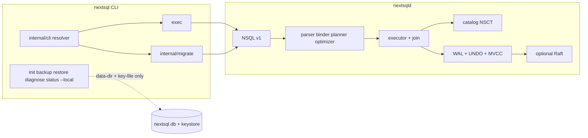
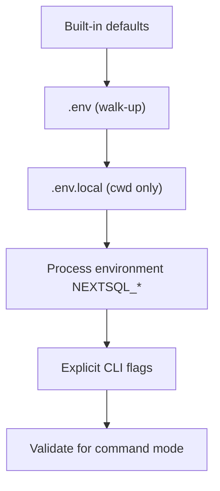
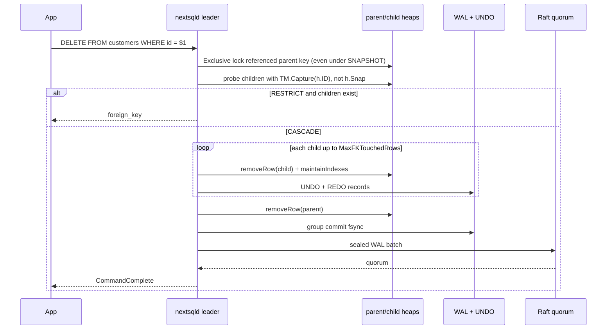
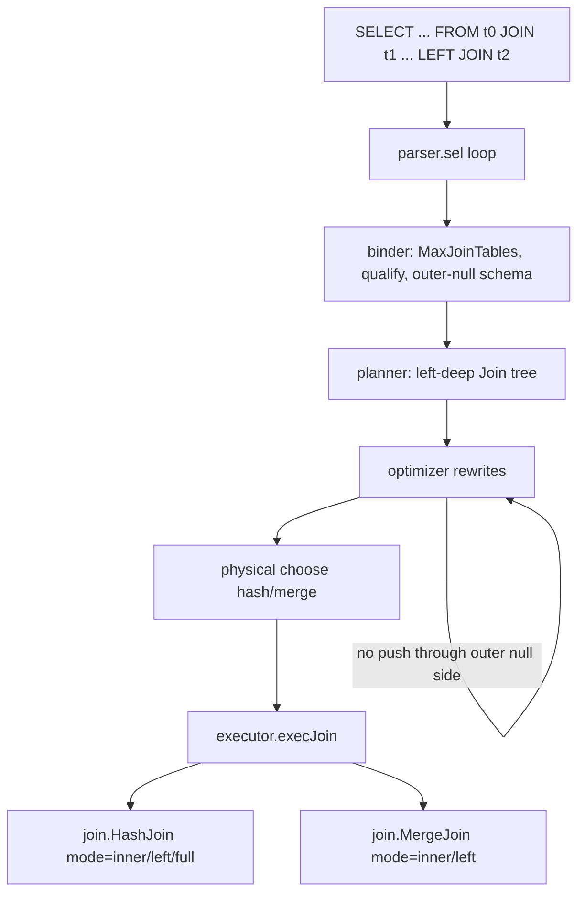

# NextSQL CLI, Schema Version Control, Foreign Keys, and Advanced Joins

| Field | Value |
|---|---|
| **Author** | NextSQL design (via Grok) |
| **Date** | 2026-08-18 |
| **Status** | Historical design record; shared-tenancy sections superseded 2026-08-28 |
| **Product** | NextSQL 0.1.0-dev (phases 0–15 implemented; Phase 16 correctness / SLO closure is open) |
| **Module** | `github.com/bzync/nextsql` |

---

> **Supersession notice:** `SET TENANT`, `RESET TENANT`, the `--tenant` /
> `NEXTSQL_TENANT` client surface, implicit `tenant_id` rewriting, and
> `PARTITION BY TENANT` have been removed. Those passages below document the
> old implementation and are not current product behavior. Current isolation
> is defined by hosted realm/database binding in
> [`design-multidatabase-dbaas.md`](design-multidatabase-dbaas.md) and
> [`security.md`](security.md).

## Overview

NextSQL is an independent encrypted-by-default multimodel engine. It already has a working CLI (`cmd/nextsql`), a native NSQL v1 wire protocol, official drivers, WAL + MVCC + envelope encryption, optional Raft HA, and a SQL pipeline that can execute one `INNER JOIN` per `SELECT`. It does **not** yet have a client configuration story, a schema-history / migrate workflow, foreign keys, or join types beyond a single inner join.

This document specifies four interlocking surfaces that turn the engine into something application teams can adopt:

1. A **client configuration and connection model** that loads `.env`, environment variables, and flags, and that cleanly separates “talk to a running `nextsqld`” from “open the data directory with the root unlock key.”
2. A **CLI-first schema version-control system** (`nextsql migrate …`) whose files live in Git and whose history lives in a reserved, primary-keyed table applied over NSQL v1.
3. **Foreign keys and cascading actions** that participate in the same WAL, MVCC, encryption, tenant, and Raft path as ordinary DML.
4. **Advanced joins** (multiple joins; `LEFT` / `RIGHT` / `FULL OUTER` / `CROSS`) built by extending the existing hash and merge operators, with an explicit later phase for `SEARCH` / `NEAREST`.

The design is written against the code that exists today. It does not pretend `ORDER BY`, `ALTER TABLE`, `DROP TABLE`, `CREATE DATABASE`, multi-join planning, or FK catalog fields are already implemented.

---

## Background & Motivation

### Current state (verified in-tree)

| Area | What exists today |
|---|---|
| Version | `internal/version`: `0.1.0-dev`, phase 15. `TODO.md` marks Phase 16 open. |
| CLI | `cmd/nextsql/main.go`: `init`, `exec`, `backup`, `restore`, `verify`, `export`, `import`, `diagnose`, `status`, `cluster status`. No `migrate`. No `.env`. `main` always `os.Exit(1)` on error. |
| `exec` | Requires `--user`, `--password-file`, and `-c`. Defaults `--addr` to `config.DefaultListenAddr` (`127.0.0.1:7210`). One-shot: open, one `Conn.Exec`, close. |
| Server config | `internal/config.Load` reads a `key=value` file for `nextsqld --config`. Unknown keys are rejected. This is **not** a client dotenv loader. |
| Status / diagnose | `status` and `diagnose` open the data directory. `diagnose` needs only `--data-dir` (plaintext headers). `status` also needs `--key-file` and calls `executor.Open`. There is no server-mode status. |
| SQL parser | `parser.Parse` accepts **one** statement; extra tokens after an optional `;` are a syntax error (`internal/sql/parser/parser.go`). |
| Joins | Parser loop already accepts repeated `JOIN` / `INNER JOIN` and sets `JoinSpec.Cross` when `ON` is omitted (`parser.go` `sel()`). Binder rejects `1+len(Joins) > security.MaxJoinTables` where `MaxJoinTables = 2`. Binder also rejects `SEARCH` or `NEAREST` with any join. Planner builds at most one `planner.Join` from `binder.Select.Right`. |
| Join execution | `internal/executor/join` implements `HashJoin` (build right, probe left; spill path exists) and `MergeJoin` (inputs must already be sorted). Optimizer chooses `"hash"` or `"merge"` in `internal/sql/optimizer/physical.go`. |
| Catalog | `catalog.Table` has `ID`, `Name`, `Columns`, `Indexes`, `PK`, `HeapMeta`, `VecMeta`. No FK fields. Encoding magic `NSCT`, `tableVersion = 1`. `DecodeTable` fails closed on any other version. Compatibility catalog in `internal/upgrade` lists `FamilyCatalog` current/min/max = 1. |
| DDL gaps | No `DROP TABLE`, `ALTER TABLE`, `CREATE DATABASE`, or `ORDER BY` (`USAGE.md` §4, §21). Every table must declare a `PRIMARY KEY` (clustered B+Tree key). |
| Types | Column types in `parser.colType`: UUID, STRING, TEXT, DECIMAL, TIMESTAMPTZ, JSON, VECTOR, POINT/LOCATION, BOX, LINESTRING, POLYGON. `KindBool` exists for predicates and `TRUE`/`FALSE` literals; **BOOL is not a creatable column type**. |
| Protocol | NSQL v1. One SQL string per `Query` / `Execute` frame. A driver connection is a session: `BEGIN` / `COMMIT` work across successive requests on that connection (`USAGE.md` §3.4, `docs/protocol.md`). `nextsql exec` does not keep a session. |
| Tenants | `tenant_id` (UUID / STRING / TEXT) + `SET TENANT` / `RESET TENANT`. Production non-ADMIN sessions must bind a tenant before touching a tenant-keyed table (`internal/executor/tenant.go`). Cross-tenant leakage tolerance is 0. |
| HA | Leader executes SQL, flushes WAL, seals a replication batch (`replication.EncodeCommand`), Raft-commits. Followers apply physical WAL records. SQL is **not** re-executed (`docs/ha.md`). |
| RBAC | Privileges already include `PrivCreate`, `PrivDrop`, `PrivAlter`, `PrivInsert`, `PrivUpdate`, `PrivDelete`, `PrivSelect`, `PrivAdmin` (`internal/security/rbac.go`). `Session.authorize` is fail-closed on unknown statement types. |
| Abuse limits | `security.MaxJoinTables = 2`. Packet / SQL 1 MiB. Result 64 MiB / 1 000 000 rows. Per-query budget 64 MiB memory, 30 s (`internal/scheduler`). |

### Pain points this design removes

1. **Operators and app developers configure the same binary two different ways.** `nextsql exec` demands flags; `nextsqld` has a config file that clients must not reuse; there is no project-local `.env`.
2. **There is no official schema-change workflow.** Teams would otherwise invent ad-hoc `nextsql exec -c` scripts or import a third-party migrator that does not know about one-statement-per-request, missing `ALTER`/`DROP`, or the reserved-name / PK / encryption rules.
3. **Referential integrity is application-only.** Without engine FKs, a `DELETE` from `customers` can orphan `orders`, and a cascade implemented in the client is not Raft-deterministic (it would re-execute SQL).
4. **Join surface is a demo, not an application dialect.** Parser already loops; the binder and planner cap at one inner join. That is the right abuse-limit starting point, not the product destination.

---

## Goals & Non-Goals

### Goals

- Ship a **NextSQL-native** CLI config + migrate UX that feels as obvious as `nextsql exec` and does not require Atlas, golang-migrate, Flyway, Prisma, or Dolt as the official path.
- Keep the **root unlock key off the application path**. App and migrate workflows talk to `nextsqld` with a user password (preferably a password file).
- Make migrations correct under the **current protocol**: one statement per request, transactional multi-statement files via a persistent driver session (`BEGIN` … `COMMIT`).
- Add FKs that are **catalog-versioned** (`NSCT` v2), fail-closed on unknown versions, WAL/MVCC/encrypted, tenant-safe, and Raft-deterministic.
- Extend joins by **raising `MaxJoinTables` in phases** and by extending `internal/executor/join`, not by inventing a third join engine.
- Give CI **stable exit codes**, dry-run, checksum, dirty, and force semantics.

### Non-goals (this design)

- Dolt-style in-database branching, remotes, or diffs. Version control is Git + CLI migrate.
- Storing migration files inside the database.
- Putting keys or passwords in URLs (drivers already reject `://`, `key=`, `password=` in `drivers/go` `validateConfig`).
- Storing the root unlock key in `.env` as the default for `exec` / `migrate`.
- Implementing `ORDER BY` as a silent dependency of the first join or migrate PR. `ORDER BY` is a later SQL feature; join result order remains unspecified except existing `SEARCH` / `NEAREST` ranking on single-table queries.
- Implementing `ALTER TABLE` / `DROP TABLE` / `CREATE DATABASE` in the migrate v1 engine path. The migrator is designed to work **without** them, and `down` is explicitly limited until those statements exist.
- Unbounded join graphs, unbounded cascade fan-out, or deferred constraint queues (SQL `DEFERRABLE` / `INITIALLY DEFERRED`).
- Combining `SEARCH` / `NEAREST` with `JOIN` in the first join increment. That is a named later phase.
- Multi-primary writes, named multi-database catalogs, or changing the encryption hierarchy.

---

## Key Decisions

These are closed for this design. Rationale is short; details live in the matching Proposed Design section.

1. **CLI-first version control, files in Git.** In-database branching (Dolt) is a different product. NextSQL’s advantage is one encrypted ACID engine; schema history should be reviewable in PRs.
2. **Two CLI modes: server and local.** `exec`, `migrate`, and default `status` always use NSQL v1 against a running `nextsqld`. `init` / `backup` / `restore` / `verify` / `export` / `import` / `diagnose` / `status --local` / `cluster status` are the only commands that touch `NEXTSQL_DATA_DIR` / `NEXTSQL_KEY_FILE`.
3. **Config priority: flags > process environment > `.env.local` > `.env` > defaults.** Existing `internal/config` stays the **server** `key=value` loader. Client loading is a new `internal/cli` package so unknown server keys and client dotenv never share a parser.
4. **Password file wins over inline password.** If both `NEXTSQL_DATABASE_PASSWORD_FILE` and `NEXTSQL_DATABASE_PASS` are set, the file is used. Inline password is allowed for CI convenience and is a documented tradeoff.
5. **Root key is never a migrate/exec input.** Even if `.env` contains `NEXTSQL_KEY_FILE`, server-mode commands ignore it.
6. **One official migrator, over a persistent Go-driver session.** `nextsql exec` stays one-shot. `nextsql migrate` opens `drivers/go` `Conn` and sends one statement per `Exec`, wrapping each file in `BEGIN`/`COMMIT`.
7. **History table name `nsql_schema_migrations`.** User-visible SQL table, required `PRIMARY KEY`, no `tenant_id` (so `SET TENANT` cannot hide it). Prefix `nsql_` is reserved.
8. **v1 `down` is best-effort and fail-closed.** Without `DROP TABLE` / `ALTER TABLE`, a down file that needs those statements is rejected. `migrate down` is not the primary workflow until DDL exists.
9. **FK catalog is `NSCT` version 2.** v1 rows still decode (empty FK list). Unknown versions fail closed. Old binaries cannot silently read v2.
10. **CASCADE is executed on the leader as ordinary row writes.** Followers see WAL records, not SQL. Tenant predicates apply to every cascaded row. FK DML takes extra shared/exclusive locks on the **referenced** key even under SNAPSHOT / READ COMMITTED, then re-checks with a probe-local `TM.Capture(h.ID)` snapshot (not `h.Snap`, not `Refresh(h)` — see D.5). Existing write locks on the child PK do not serialize parent DELETE.
11. **Join expansion is left-deep over existing hash/merge.** Raise `MaxJoinTables` 2 → 4 → 8. No new join method in v1. Fix NULL-key inner-join matching in **both** `join.keyString` (hash / spill / `ParallelHash`) and `join.cmpKeys` (merge) as part of the first join PR.
12. **`SEARCH`/`NEAREST` + `JOIN` is phase-gated.** Binder keeps the current rejection until that phase. Do not require `ORDER BY` to ship multi-join or `LEFT JOIN`.
13. **`NO ACTION` is a synonym of `RESTRICT` in v1.** There is no deferred-constraint queue. Document the synonym; do not pretend PostgreSQL-style end-of-statement `NO ACTION` exists.

---

## Proposed Design

The four features share one client, one protocol, one catalog, and one executor. They are specified in the labeled sections A–G the implementation must treat as normative.



---

### A. Configuration & Connection Model

#### A.1 Two modes

| Mode | Commands | How it authenticates | Required material |
|---|---|---|---|
| **Server** | `exec`, `migrate …`, `status` (default), future `ping` | NSQL v1 user + password | Address, user, password (file preferred), `TLS` **or** `InsecureNoTLS` (loopback still needs `--insecure`; see A.10) |
| **Local** | `init`, `backup`, `restore`, `verify`, `export`, `import`, `diagnose`, `status --local`, `cluster status` | Root unlock key opens the envelope / headers | `--data-dir` and, except `diagnose` / `cluster status`, `--key-file` |

`diagnose` stays header-only (no key), matching `upgrade.Inspect`. `cluster status` stays a local read of the Raft status file (`replication.ReadStatusFile`).

Mixing modes on one invocation is an error: if a server-mode command is given `--data-dir` / `--key-file`, refuse with `invalid_argument` and tell the operator to use a local command. If a local command is given `--addr` / `--user`, refuse unless the command documents a dual mode (`status` is the only dual-mode command, and it uses `--local` to disambiguate).

#### A.2 New package `internal/cli`

Do **not** extend `internal/config.Load`. That parser rejects unknown keys and is bound to `nextsqld` (`data_dir`, `key_file`, `listen_addr`, Raft, admission). Client dotenv will contain `NEXTSQL_DATABASE_USER` and similar names that would be illegal there.

```
internal/cli/
  dotenv.go      # parse KEY=VALUE, comments, optional quotes
  resolve.go     # merge flags + env + files into cli.Settings
  connect.go     # build drivers/go Config (server mode)
  exit.go        # map nerr.Code + migrate faults to process exit codes
```

`cmd/nextsql` becomes a thin dispatcher. Flag sets still live per-command so `flag.FlagSet` help text stays accurate; each command calls `cli.Resolve(fs, os.Args)` after `Parse`.

#### A.3 File discovery

1. If `--no-env` is set, skip files.
2. If `--env-file PATH` is set, load only that file. Missing file is an error.
3. Otherwise, walk from `os.Getwd()` toward `/` (max 16 levels). At each directory, if `.env` exists, record it and stop walking for the base file. Independently, if `.env.local` exists in the **starting** working directory, record it as an overlay. Do not walk `.env.local` from parent directories (so a user can keep secrets in cwd without inheriting a parent’s local overlay).

`.env.local` is the recommended gitignored overlay. Neither file is required.

#### A.4 Priority (highest wins)



A value is “set” when it is non-empty after trim. Empty environment variables do not override a file value (avoids `NEXTSQL_DATABASE_USER=` in a systemd unit wiping `.env`). Explicit flags, including empty strings where the flag is present, override everything.

`flag` visited-set (already used in `cmd/nextsqld/main.go` via `fs.Visit`) is the source of “explicit flag.”

#### A.5 Environment variables

**Server-mode (app, exec, migrate)**

| Variable | Meaning | Default |
|---|---|---|
| `NEXTSQL_ADDR` | `host:port` | `127.0.0.1:7210` (`config.DefaultListenAddr`) |
| `NEXTSQL_DATABASE_USER` | Database/client auth user | none (required) |
| `NEXTSQL_DATABASE_PASSWORD_FILE` | Path to database/client password file (newline stripped, same as `auth.ReadPasswordFile`) | none |
| `NEXTSQL_DATABASE_PASS` | Inline database/client password | none |
| `NEXTSQL_SERVER_USER` | Server/bootstrap principal; never a client fallback | none |
| `NEXTSQL_SERVER_PASSWORD_FILE` | Preferred server/bootstrap password-file path | none |
| `NEXTSQL_SERVER_PASS` | Inline server/bootstrap password for automation | none |
| `NEXTSQL_DATABASE` | Hello `database` field | empty (optional; server compares only if both sides set — `protocol/server.go`) |
| `NEXTSQL_TLS_CA` | PEM CA / server cert | none |
| `NEXTSQL_TLS_SERVER_NAME` | TLS certificate/SNI server name | host from `NEXTSQL_ADDR` |
| `NEXTSQL_INSECURE` | `true`/`1`/`yes` → `InsecureNoTLS` | false |
| `NEXTSQL_MIGRATION_DIR` | Migration directory | `./migrations` |
| `NEXTSQL_TENANT` | Optional `SET TENANT` after connect (migrate/exec) | unset |

**Local-mode only**

| Variable | Meaning | Used by |
|---|---|---|
| `NEXTSQL_DATA_DIR` | Data directory | init, backup, restore, export, import, diagnose, status --local, cluster status |
| `NEXTSQL_KEY_FILE` | Root unlock key path | all local commands except diagnose and cluster status |
| `NEXTSQL_BUFFER_PAGES` | Buffer pool pages | init, backup, restore, export, import, status --local |

**Never used as a connection URL.** `cli.connect` builds `nextsql.Config{Address, Database, User, Password, TLS, InsecureNoTLS}` only. If `Address` contains `://`, `key=`, or `password=`, the existing driver `validateConfig` rejects it; the CLI should reject earlier with a clearer message.

#### A.6 Password resolution

```
if password-file flag or NEXTSQL_DATABASE_PASSWORD_FILE is set:
    password = auth.ReadPasswordFile(path)
else if NEXTSQL_DATABASE_PASS is set:
    password = that value
    print one-line stderr warning: "using NEXTSQL_DATABASE_PASS from the environment; prefer NEXTSQL_DATABASE_PASSWORD_FILE"
else:
    error: password required
```

**Security tradeoff (inline password):** process listings, systemd `Environment=`, CI logs, and crash dumps can leak `NEXTSQL_DATABASE_PASS`. A mode-`0600` file cannot be stolen from `ps`. Official docs and examples use the file. Inline is permitted so GitHub Actions can pass a database-password secret without writing a workspace file; the Action example still prefers a file in `/run` when practical.

Do **not** add `NEXTSQL_ROOT_KEY` or accept raw key bytes in the environment.

#### A.7 `exec` after this change

```
nextsql exec [-c SQL] [--addr] [--user] [--password-file] [--database] [--tls-ca | --insecure]
```

- `--user`, `--password-file`, `-c` are no longer all-required-as-flags. After resolve, `user`, password, and SQL must be present or the command errors.
- `-c` may be omitted if SQL is passed as a single positional argument (`nextsql exec "SELECT 1"`). If both are present, `-c` wins.
- Env fallbacks apply as in A.5.
- Still one statement, still one-shot. Multi-statement scripts belong in `migrate` or a driver.

#### A.8 `status` split

| Invocation | Behavior |
|---|---|
| `nextsql status` | Server mode. Dial, handshake, print `mode server`, addr, user, database, `ok`. No data-dir. Does not print LSNs (those require opening storage). |
| `nextsql status --local` | Today’s `statusDB`: `upgrade.Inspect` + `executor.Open` + metrics. Requires data-dir + key-file. |
| Both `--addr` and `--local` | Error. |

A later increment may add `SHOW STATUS` SQL so server-mode can print admission counters without the root key. That SQL does not exist today and is **not** a blocker.

#### A.9 `nextsqld` is unchanged

Server flags and `internal/config` stay as they are. Operators may still put `key_file=` in the **server** config file. That file is not a client `.env` and must remain off application hosts.

#### A.10 Validation rules

These match `drivers/go` `validateConfig` and `security.RequireTLS`. The CLI must not special-case loopback more loosely than the driver.

- **Every** server-mode connect must set `Config.TLS` **or** `Config.InsecureNoTLS`. `TLS == nil && !InsecureNoTLS` is an error for **every** address, including `127.0.0.1`. Loopback still requires `--insecure` / `NEXTSQL_INSECURE=true` **or** `--tls-ca` / a constructed TLS config.
- `--insecure` / `NEXTSQL_INSECURE` + non-loopback → error (`security.RequireTLS`). Plaintext is loopback-only.
- Server mode + missing user or password → error.
- Local mode + missing data-dir → error.
- Local mode (except diagnose / cluster status) + missing key-file → error.
- `NEXTSQL_KEY_FILE` present while running `exec`/`migrate` → ignored, no fatal. Optional debug log only if `--verbose` is added later; default is silent so CI logs do not advertise the key path.

G.1 and G.5 keep `NEXTSQL_INSECURE=true` for job-local `nextsqld` on `127.0.0.1`. A laptop that omits both `--insecure` and `--tls-ca` must fail at resolve/`Open`, not hang or invent a loopback exception.

---

### B. Complete CLI Migration Commands

#### B.1 Command set

```
nextsql migrate status
nextsql migrate pending
nextsql migrate version
nextsql migrate validate
nextsql migrate create NAME
nextsql migrate up    [--count N] [--to VERSION] [--dry-run]
nextsql migrate down  [--count N] [--to VERSION] [--dry-run]   # limited in v1
nextsql migrate force VERSION --confirm
nextsql migrate repair --confirm
```

Global migrate flags (all subcommands):

```
--dir DIR            migrations directory (default NEXTSQL_MIGRATION_DIR or ./migrations)
--addr --user --password-file --database --tls-ca --insecure
--env-file --no-env
--tenant VALUE       optional SET TENANT after connect (also NEXTSQL_TENANT)
```

`migrate` is **always server mode**. It never opens `--data-dir`. Remote and local `nextsqld` behave identically: TLS rules follow the address.

#### B.2 Behavior of each command

| Command | Connects? | Writes? | Success output |
|---|---|---|---|
| `status` | yes | no (may CREATE history table if missing — see B.5) | current version, dirty flag, applied count, pending count, checksum mismatches |
| `pending` | yes | no | list of unapplied versions (or empty + exit 0) |
| `version` | yes | no | single line: version or `none` |
| `validate` | no | no | parses files, checks uniqueness, pairing, SQL parse; no server needed |
| `create NAME` | no | filesystem only | prints paths of new empty `.up.sql` / `.down.sql` |
| `up` | yes | yes | applies pending in order; prints each version |
| `down` | yes | yes | rolls back last N; v1 rejects unimplemented SQL |
| `force V` | yes | yes | sets history to V, clears dirty, does **not** run SQL |
| `repair` | yes | yes | recomputes checksums of **already applied** files to match the working tree; does not apply |

#### B.3 Transaction policy (normative)

Hard constraint: `parser.Parse` and the wire `Query` message accept one statement. A persistent `drivers/go` `Conn` **can** `BEGIN`, then `Exec` many times, then `COMMIT` — this is how applications already use the driver (`USAGE.md` §3.4 / §15).

For each migration **file** the runner:

1. `BEGIN` (default SNAPSHOT isolation — existing `ast.Begin` with empty Isolation).
2. Insert the dirty history row with this exact statement (all `NOT NULL` columns except `applied_at`, which has `DEFAULT NOW()`):

```sql
INSERT INTO nsql_schema_migrations
    (version, name, checksum, execution_ms, dirty, direction)
VALUES
    ($1, $2, $3, 0, 1, 'up')
```

   Bind `$1` = 14-digit version, `$2` = slug, `$3` = C.4 checksum of the **up** file (`down` uses `direction = 'down'`). Concurrent migrators lose here: `btree.Insert` returns `already_exists` on the history PK. First committer wins for that version.

3. Split the file into statements (C.3) and `Exec` each one, in order, on the **same** connection.
4. Finalize:

```sql
UPDATE nsql_schema_migrations
SET dirty = 0, applied_at = NOW(), execution_ms = $1
WHERE version = $2
```

5. `COMMIT`.

On any error: `ROLLBACK` (best effort) and leave the **MVCC** database as it was before that file. Because the dirty `INSERT` is in the same transaction, a failed file does **not** persist a dirty row **unless** a statement bypassed the session txn (see below and C.6).

**Crash during a file.** NextSQL catalog DDL today uses the session transaction (`docs/sql.md`: catalog mutations share the WAL + MVCC txn). Security-catalog statements (`CREATE`/`DROP` `USER`/`ROLE`, `GRANT`/`REVOKE`) do **not** — they `os.WriteFile` `nextsql.users` / `nextsql.acl` immediately (`executor.execSecurity` → `ACL.persist`). v1 therefore requires:

- Files must **not** contain `BEGIN`, `COMMIT`, or `ROLLBACK`. `validate` and the runner reject those after parse.
- Files must **not** contain `SET TENANT` / `RESET TENANT`. Pass `--tenant` on the CLI; the runner issues `SET TENANT` **before** `BEGIN` so it is session state, not transactional. `RESET TENANT` at the end of the migrate process.
- Files must **not** contain `CREATE USER`, `DROP USER`, `CREATE ROLE`, `DROP ROLE`, `GRANT`, or `REVOKE` (exit 6, same fail-closed path as `DROP TABLE`). Those persist outside WAL and would survive `ROLLBACK`. Run them out of band, not in a migration file.

If a crash still leaves a dirty row (kill after commit of a partial future statement type that ignores the txn), `migrate up` refuses with exit 3 until `force` or a successful retry after manual repair.

#### B.4 Dry-run

`--dry-run` connects, reads history, lists the files that **would** run, checksums them, and parses every statement with `parser.Parse`. It does not `BEGIN`, does not `INSERT` history, and does not execute user SQL. Exit 0 if the plan is valid; exit 6 if a file would be rejected.

#### B.5 History table bootstrap

If `nsql_schema_migrations` is missing, `status` / `up` / `force` / `repair` create it **before** the per-file loop (`validate` and `create` do not):

1. Auto-commit the exact C.2 `CREATE TABLE` text (byte-for-byte after whitespace-normalize: collapse runs of space/newline to a single space, fold unquoted idents). The executor allows this **one** reserved name when the table is absent **and** the statement matches that DDL; there is no session flag and no `PrivMigrate`. Any other `CREATE TABLE nsql_…` is rejected. Any other `CREATE TABLE nsql_schema_migrations` (wrong columns) is rejected even if the table is absent.
2. **Do not send `GRANT` SQL from the CLI.** `Session.authorize` for `ast.Grant` requires `PrivGrant` on `ScopeCluster` or `PrivAdmin` (`executor/security.go`). A `CONNECT`+`CREATE` migrator would get `forbidden`, CREATE would have already succeeded, and the dirty `INSERT` would still fail. Instead, inside `execCreateTable`, **after** the reserved history DDL is accepted and the catalog row is inserted, the executor calls `s.acl.Grant` four times for `s.user` (the handshake user):

```go
for _, p := range []security.Privilege{
    security.PrivSelect, security.PrivInsert, security.PrivUpdate, security.PrivDelete,
} {
    if err := s.acl.Grant(s.user, p, security.ScopeTable, "nsql_schema_migrations"); err != nil {
        return nil, err
    }
}
```

   This is the same persist path as other ACL writes (`ACL.Grant` → `persist`). It does **not** go through `authorize` for `ast.Grant` and therefore does **not** require `PrivGrant`. It is not WAL-transactional (same as every ACL write today). `ACL.Grant` is already idempotent (duplicate grantee/priv/scope/object is a no-op). Cluster `ADMIN` still bypasses table grants; the side-effect is what makes a least-privilege `migrator` usable (B.9).

3. If the table already exists, skip CREATE (and skip the server-side grants — they were applied on first create). First bootstrap must be run **as the migrator user** so `s.user` receives the four privileges. If an ADMIN created the table earlier, a later `CONNECT`+`CREATE` migrator has no table DML: fail `forbidden` on the history `INSERT` and tell the operator to `GRANT` out of band or re-bootstrap as that user.

Creation still requires `PrivCreate` on `ScopeDatabase`. If a user table already exists with that name but the wrong schema, fail closed (`invalid_argument`): do not `ALTER`.

#### B.6 Checksum mismatch

After listing applied rows, the runner checksums each corresponding file still on disk. If a file is missing or the digest differs, `status` prints `checksum_mismatch` per version and returns exit 4. `up` / `down` refuse. `repair --confirm` updates stored checksums to the files’ current digests. This is intentional for “we fixed a comment in an already-applied file”; it is not a way to re-run SQL.

#### B.7 Dirty / force

- `dirty = 1` on any history row → `up` / `down` abort, exit 3. `status` prints the dirty version.
- `force VERSION --confirm` (required flag):
  - If VERSION is `0` or `none`: delete all history rows (does not drop objects).
  - Else: delete rows with version > VERSION; upsert VERSION as clean with checksum of the matching file if present, else checksum `forced`.
- Force never executes migration SQL.

#### B.8 `down` in v1 (honest)

`migrate down` is implemented so the command exists and CI can test the machinery, but it is **not** a complete rollback product until `DROP TABLE` / `ALTER TABLE` land.

For each down file, after parse:

- If any statement is `DROP TABLE`, `ALTER TABLE`, `DROP INDEX`, or another unimplemented kind, abort that file with exit 6 and a message that names the missing engine feature.
- Remaining legal downs: `DELETE`, `INSERT`, `UPDATE`, `CREATE TABLE` / `CREATE INDEX` of compensating objects. Not `GRANT`/`REVOKE`/`CREATE USER` (C.6).

If a version has no `.down.sql`, `migrate down` refuses that version (exit 6). Do not invent a reverse.

Recommended v1 app workflow: **forward-only** (`up`). Compensate with a new `up` file.

#### B.9 Privileges

The migrate user needs:

- `CONNECT` on the database
- `CREATE` on the database (bootstrap + `CREATE TABLE` / `CREATE INDEX` in files)
- `SELECT`, `INSERT`, `UPDATE`, `DELETE` on `nsql_schema_migrations`
- Privileges required by the files themselves (`INSERT` into app tables, etc.)

Cluster `ADMIN` (what `nextsql init --user` grants) is sufficient and is the simplest v1 operator. A dedicated `migrator` role (`CONNECT` + `CREATE`) is supported **because `execCreateTable` grants table DML to `s.user` when it accepts the reserved history DDL** (B.5). That path must **not** be a `GRANT` statement: `authorize(ast.Grant)` requires `PrivGrant` on CLUSTER, which the migrator does not have. New tables do **not** otherwise auto-grant the creator. Do not add `PrivMigrate` in v1. `Session.authorize` already fail-closes unknown statements.

`--tenant`: if set, runner `SET TENANT` after connect. Production non-ADMIN users **must** set a tenant before files touch tenant-keyed tables (`executor.applyTenant`). History has no `tenant_id`, so it remains visible.

#### B.10 Remote vs local server

No behavioral fork. A remote VPS and a laptop `nextsqld` are the same NSQL session. Differences are only transport (TLS required off loopback) and latency. The migrator does not, and must not, open the remote data directory or use the root key.

On Raft: connect to the **leader** (or a listener that fails closed on a follower write). Writes already fail with `unavailable` if there is no leader (`docs/ha.md`). History inserts and `CREATE TABLE` replicate as WAL records; followers do not re-run the migrator.

#### B.11 Exit codes

`internal/cli/exit.go` maps errors. `cmd/nextsql/main.go` uses `os.Exit(cli.Code(err))` instead of unconditional `1`.

| Code | When |
|---|---|
| 0 | Success |
| 1 | Usage, unknown command, invalid flags (`nerr.InvalidArgument` without a more specific migrate fault) |
| 2 | Connection / auth / TLS (`nerr.IO`, `nerr.Unauthorized`, `nerr.Protocol`, `nerr.Unavailable` on dial) |
| 3 | Dirty history (`migrate.ErrDirty`) |
| 4 | Checksum mismatch (`migrate.ErrChecksum`) |
| 5 | SQL execution error while applying (syntax at runtime, `conflict`, `foreign_key`, `forbidden`, …) |
| 6 | Validation error (bad filenames, duplicate versions, unimplemented down SQL, empty dir when required) |
| 7 | Local-mode missing data-dir / key-file (existing local commands) |

`nerr` stays the typed error. Add two sentinel wraps in `internal/migrate`:

```go
var (
    ErrDirty    = nerr.New(nerr.Conflict, "migrate", "database is dirty")
    ErrChecksum = nerr.New(nerr.InvalidFormat, "migrate", "migration checksum mismatch")
)
```

Do not put passwords or key paths in error messages (existing `nerr` contract).

#### B.12 Concurrency

Advisory locks do not exist. The history PK insert **is** the lock (B.3). Two CI jobs against one database: one commits the version, the other hits `already_exists` and exits 5 (or 3 if it observed dirty). Document “one migrator per database” in `USAGE.md`.

---

### C. Migration File Format & System Table

#### C.1 Directory and naming

Default directory: `./migrations` (override `--dir` / `NEXTSQL_MIGRATION_DIR`).

```
migrations/
  20260818120000_create_customers.up.sql
  20260818120000_create_customers.down.sql
  20260818120100_create_orders.up.sql
  20260818120100_create_orders.down.sql
```

Pattern:

```
^(\d{14})_([a-z0-9_]+)\.(up|down)\.sql$
```

- Version is a 14-digit UTC timestamp `YYYYMMDDHHMMSS` used as a monotonically increasing identifier. `migrate create NAME` starts at the later of `time.Now().UTC()` or one second after the latest existing version, then advances only on an atomic version-claim collision. There is no fixed retry window: same-second and bulk scripted creates continue into future-formatted versions without waiting for wall-clock time.
- `NAME` is slugged: lowercase, non-`[a-z0-9]+` → `_`, trim, max 64 chars.
- Pairing: a version may have up only (forward-only). Down without up is a validate error.
- Versions must be unique. Two files with the same timestamp fail `validate`.

Why timestamps instead of `V001__` (Flyway): less rebase collision in feature branches; still totally ordered. Integer prefixes `0001_name.up.sql` are **not** accepted in v1 (one convention).

#### C.2 History table DDL

`KindBool` is not a column type (`parser.colType`). Use `DECIMAL(1,0)` for the dirty flag.

```sql
CREATE TABLE nsql_schema_migrations (
    version      STRING PRIMARY KEY,
    name         STRING NOT NULL,
    applied_at   TIMESTAMPTZ NOT NULL DEFAULT NOW(),
    checksum     STRING NOT NULL,
    execution_ms DECIMAL(12,0) NOT NULL,
    dirty        DECIMAL(1,0) NOT NULL,
    direction    STRING NOT NULL
)
```

| Column | Invariant |
|---|---|
| `version` | 14-digit string; clustered PK |
| `name` | slug |
| `applied_at` | set on successful finalize; `NOW()` default |
| `checksum` | lowercase hex SHA-256 of the **up** file bytes after newline normalization (C.4); down files are checksummed separately only for `validate` |
| `execution_ms` | wall time of the file transaction |
| `dirty` | `0` clean, `1` in progress |
| `direction` | `up` or `down` (last successful direction for this version; after down the row is **deleted**) |

No `tenant_id`. The table is cluster-global. It is encrypted like every other heap (page DEK). It replicates via WAL.

**Reservation.** There is no migrator session flag. `catalog.TableFromAST` / `execCreateTable` reject `CREATE TABLE` names that start with `nsql_` (case-folded). Exception — **exactly one** statement is legal:

- the table name is `nsql_schema_migrations`, **and**
- no table with that name exists in overlay ∪ catalog, **and**
- the statement matches the C.2 DDL after the whitespace-normalize in B.5.

Any other `nsql_*` name, or a different column list for `nsql_schema_migrations`, is `invalid_argument`. The migrator issues that exact DDL; so can any `PrivCreate` session (bootstrap is not identity-gated). `execCreateTable` then `acl.Grant`s table DML to `s.user` (B.5) — no `GRANT` SQL.

#### C.3 File contents and splitter

A file is UTF-8 SQL. Comments:

- `--` to end of line
- `/* … */` (non-nested)

**Preferred style: one statement per file.** That matches the engine and reviews cleanly.

Multi-statement files are supported because `CREATE TABLE` + `CREATE INDEX` is the common case and `ALTER` does not exist yet. The splitter:

1. Scans with a small state machine (string literals `'…'` with `''` escapes, quoted `"ident"`, line/block comments).
2. Splits on `;` at depth 0.
3. Trims whitespace; drops empty fragments.
4. Parses **each** fragment with `parser.Parse`. Failure → the whole file is rejected before any `BEGIN`.

Limits (reuse engine caps, fail before send):

- File size ≤ 1 MiB (`security.MaxSQLBytes`) **per statement after split**. A file may be larger than 1 MiB if each statement is not.
- Statements per file ≤ **32**.
- Total statements in one `migrate up` invocation ≤ **4096**.

#### C.4 Checksum algorithm

```
normalized = replace CR LF → LF, strip a single trailing UTF-8 BOM if present
checksum  = hex(SHA-256(normalized))
```

Do not strip comments (comment edits change the digest). `repair` is the escape hatch.

#### C.5 `migrate create`

```
nextsql migrate create add_orders
# writes:
#   migrations/20260818143000_add_orders.up.sql
#   migrations/20260818143000_add_orders.down.sql
```

Files are created with a header comment only:

```sql
-- migrate:up 20260818143000 add_orders
-- NextSQL 0.1.0-dev: one statement per request; this file is split on ';'.
-- Do not include BEGIN/COMMIT/ROLLBACK.
```

#### C.6 What v1 files can and cannot do

| Can (engine exists **and** rolls back with the file txn) | Cannot |
|---|---|
| `CREATE TABLE` / `CREATE INDEX` (all current index kinds) | `DROP TABLE`, `ALTER TABLE`, `DROP INDEX` (engine missing) |
| `INSERT` / `UPDATE` / `DELETE` | `CREATE DATABASE`, `ORDER BY` |
| `ANALYZE` | `CREATE`/`DROP` `USER`/`ROLE`, `GRANT`/`REVOKE` (engine exists but **auto-commits** to `nextsql.users` / `nextsql.acl`; v1 migrator **rejects** them so `ROLLBACK` stays honest) |
| | Multi-join / `LEFT JOIN` / FK **until those PRs land** |
| | Combining `SEARCH`/`NEAREST` with `JOIN` until that phase |

A migration that needs a column added **before `ALTER TABLE` exists** must create a new table, copy, and leave the old table (or wait). Document this honestly in `USAGE.md`. Do not generate `ALTER` in `migrate create` templates.

---

### D. Foreign Key + CASCADE Design

#### D.1 SQL syntax

Lexer additions (`internal/sql/lexer`): `foreign`, `references`, `constraint`, `cascade`, `restrict`, `action`, `match`, `left`, `right`, `full`, `cross`, `outer` (join keywords listed here because they ship in the same lexer PR or an adjacent one). These are **reserved** like today’s `user`, `key`, `to`: unquoted `left` becomes `KwLeft`, not an identifier. Quoted `"left"` remains an ident. Do not invent contextual keywords.

Parser extensions in `createTable` / `columnDef` (today only `NOT NULL`, `PRIMARY KEY`, `DEFAULT`):

```sql
-- table constraint
CREATE TABLE orders (
    id          UUID PRIMARY KEY DEFAULT UUID(),
    tenant_id   UUID NOT NULL,
    customer_id UUID NOT NULL,
    status      STRING NOT NULL DEFAULT 'open',
    CONSTRAINT fk_orders_customer
        FOREIGN KEY (tenant_id, customer_id)
        REFERENCES customers (tenant_id, id)
        ON DELETE RESTRICT
        ON UPDATE RESTRICT
);

-- column shorthand
CREATE TABLE lines (
    id        UUID PRIMARY KEY DEFAULT UUID(),
    order_id  UUID NOT NULL REFERENCES orders (id) ON DELETE CASCADE,
    sku       STRING NOT NULL
);
```

Grammar (v1):

```
column_constraint =
    NOT NULL
  | PRIMARY KEY
  | DEFAULT expr
  | [CONSTRAINT name] REFERENCES ident '(' ident_list ')' [ref_actions]

table_constraint =
    PRIMARY KEY '(' ident_list ')'
  | [CONSTRAINT name] FOREIGN KEY '(' ident_list ')'
        REFERENCES ident '(' ident_list ')' [ref_actions]

ref_actions = { ON DELETE ref_action | ON UPDATE ref_action }

ref_action = CASCADE | RESTRICT | NO ACTION | SET NULL | SET DEFAULT
```

Unnamed constraints get `fk_<child>_<cols>` truncated to 63 chars, uniqued with a numeric suffix.

`MATCH SIMPLE` is the only match policy (default, optional keyword). `MATCH FULL` is rejected with a clear error.

There is no `ALTER TABLE ADD CONSTRAINT` in v1. FKs are declared at `CREATE TABLE` time only. Adding an FK to an existing table waits on `ALTER TABLE`.

#### D.2 Supported actions

| Action | ON DELETE | ON UPDATE | v1 notes |
|---|---|---|---|
| `RESTRICT` | reject if any child row references the old key | same | **Default** if omitted |
| `NO ACTION` | same as `RESTRICT` | same | Synonym in v1; no deferred check |
| `CASCADE` | delete matching children (recursive) | update child FK columns to the new parent key | Depth and row caps in D.7 |
| `SET NULL` | set FK columns to NULL | same | DDL rejected if any FK column is `NOT NULL` |
| `SET DEFAULT` | `ApplyDefault(i, Null(type))` per FK column (not the live value — D.5) | same | DDL rejected if any FK column has `DefNone` |

Self-referential FKs are allowed. Cascades use a per-statement visited-key set to stop cycles.

Cyclic **CASCADE** graphs at DDL time (A cascades to B cascades to A) are rejected. Cyclic **RESTRICT** graphs are allowed (org charts, graphs).

#### D.3 Catalog and `NSCT` v2

```go
// internal/catalog/catalog.go

type FKAction uint8

const (
    FKRestrict FKAction = iota // also NO ACTION
    FKCascade
    FKSetNull
    FKSetDefault
)

type ForeignKey struct {
    Name       string
    Columns    []int    // child ordinals
    RefTable   string   // referenced table name (folded)
    RefTableID uint32   // stable id; name is for display / rewrite
    RefColumns []int    // parent ordinals (PK or unique index)
    OnDelete   FKAction
    OnUpdate   FKAction
}
```

`catalog.Table` gains `ForeignKeys []ForeignKey`. `Clone` deep-copies it.

**Encoding** (`internal/catalog/encode.go`):

- Bump `tableVersion` from `1` to `2`.
- `EncodeTable` writes v2: existing v1 payload, then `u16` FK count, then each FK (`name`, `u16` col count + ordinals, `ref table` string, `u32` ref id, `u16` ref col count + ordinals, `on_delete u8`, `on_update u8`).
- `DecodeTable`:
  - `ver == 1`: current path; `ForeignKeys` empty. Extra trailing bytes after `VecMeta` stay ignored as today (v1 already allows optional `VecMeta`).
  - `ver == 2`: parse the FK block; leftover bytes are `invalid_format`.
  - else: `unsupported catalog version` (fail closed).

`internal/upgrade.Catalog` `FamilyCatalog`: `Current = 2`, `MinReadable = 1`, `MaxReadable = 2`. `diagnose` then reports v2 as compatible with this binary and incompatible with an older one.

**Inbound index.** Do **not** dual-write inbound FK lists on the parent (avoids catalog update cycles). At DML time, discover inbound FKs from **overlay ∪ catalog**, not `Store.List()` alone:

```go
// Session.inboundFKs(parent *catalog.Table) []catalog.ForeignKey
// 1. Snapshot names: every key in s.overlay, plus every table in s.db.Cat.List().
// 2. For each name, t, ok := s.lookup(name)  // overlay wins, same as binder.
// 3. Keep t.ForeignKeys whose RefTableID == parent.ID (or RefTable == parent.Name
//    if the parent is overlay-only and IDs were assigned in this txn).
```

`Session.lookup` already prefers `overlay` (`session.go`). Uncommitted `CREATE TABLE` children live only there until `commit()` clears overlay. A same-txn file `BEGIN; CREATE parent; CREATE child FK; INSERT; DELETE parent; COMMIT` must see that inbound FK. Catalog generation still bumps after commit.

**Referenced columns** must be:

- exactly the parent `PRIMARY KEY`, or
- exactly the column set of a `UNIQUE` btree index on the parent (`catalog.Index.Unique && !Fulltext && !Vector && !Spatial`).

Types must be pairwise `Kind`+precision compatible (`types.Coerce` must succeed both ways for equality). `VECTOR` and `JSON` cannot be FK columns. Superkeys are **not** accepted: if the parent PK is `(id)` alone, `REFERENCES parent (tenant_id, id)` is illegal unless a UNIQUE btree index exists on **exactly** `(tenant_id, id)`. Recommended app pattern is `PRIMARY KEY (tenant_id, id)` (G.3).

#### D.4 Binder / CREATE TABLE validation

In `catalog.TableFromAST` or a new `catalog.ValidateForeignKeys(child, lookup)` called from `binder.bindCreateTable` (today `bind` of `CreateTable` only calls `TableFromAST`):

1. Referenced table exists (same database / catalog — there is only one).
2. Column counts match; every name resolves.
3. Types match; no VECTOR/JSON.
4. Parent key is PK or UNIQUE.
5. `SET NULL` / `SET DEFAULT` legality.
6. Name unique among FKs on the table.
7. Cycle check for CASCADE.
8. Tenant rule (D.6).
9. Limits (D.7).

`CREATE TABLE` of a child that references a table created earlier in the **same migration transaction** works: the parent `CREATE TABLE` is visible in the session overlay (`executor.Session.overlay`) after it executes, and the next `Exec` sees it. Cross-file is the normal case.

#### D.5 Runtime enforcement (leader)

All checks run inside the same `Session` transaction as the user statement (`execInsert` / `execUpdate` / `execDelete` in `internal/executor/exec.go`). Row mutations still go through `writeRow` / `replaceRow` / `removeRow` so secondary indexes, vectors, and full-text stay consistent.

New `nerr` code: `ForeignKey Code = "foreign_key"`. CLI migrate maps it to exit 5.

**Lock protocol (normative — SNAPSHOT / READ COMMITTED too)**

`docs/mvcc.md` and `btree.Txn.lockWrite` give SNAPSHOT / RC writers exclusive locks **only on keys they write**, and `lockWrite` **skips** entirely when `Iso < Serializable && TM.ActiveCount() <= 1`. `lockRead` / range locks run only for SERIALIZABLE. Child `INSERT` therefore exclusive-locks the **child** PK; parent `DELETE` exclusive-locks the **parent** PK. Those keys do not conflict. Parent existence checks and inbound probes are snapshot reads and take no shared lock. First-committer-wins does not apply across different keys. SERIALIZABLE point/range locks on the scan the statement happens to do are **not** a substitute.

Classic race without extra locks:

1. T1 `DELETE` parent: snapshot sees no children, exclusive-locks parent PK (or skips if it was the sole txn).
2. T2 `INSERT` child: snapshot still sees parent, exclusive-locks child PK, commits.
3. T1 commits → orphan. The reverse interleaving drops a live child / fails to RESTRICT.

Required, **even under SNAPSHOT and READ COMMITTED**, including migrate’s default `BEGIN`:

1. **Child INSERT / UPDATE** of a MATCH SIMPLE key that is fully non-null: `TM.LockKey(h, refKey, txn.Shared)` on the **referenced parent unique/PK key** *before* the existence lookup; then look up; then insert/update the child.
2. **Parent DELETE / UPDATE** of referenced columns: `TM.LockKey(h, refKey, txn.Exclusive)` on that same parent key *before* the inbound probe. Heap PK writers already take Exclusive on the PK via `lockWrite` when another txn is live; still take this lock on the FK path so the sole-writer skip cannot drop it. Unique-index-referenced keys use the unique-index key, not only the heap PK.
3. **Re-check** parent existence / inbound children **after** the lock is held, using a **probe-local latest-committed snapshot** (see Visibility below). A lookup with `h.Snap` is not sufficient.
4. Call `txn.Manager.LockKey` / `LockManager.Acquire` **directly**. Do **not** go through `btree.Txn.lockWrite` / `lockRead` (those skip under SNAPSHOT when `ActiveCount() <= 1`, and `lockRead` is SERIALIZABLE-only).

**Lock identity** must be the **same bytes** the parent’s write path already uses, so the new Shared lock conflicts with the parent’s Exclusive write lock. `LockManager` is process-global and is **not** table-qualified today (`Acquire` keys by raw `[]byte`). Do not invent a new namespace:

- PK-referenced: `types.EncodeKey(parent.PKValues(parentRow))` — same as `writeRow` / `removeRow` `lockWrite` on the parent heap.
- Unique-index-referenced: the unique-index key `indexKV` would `Insert` (`exec.go`) — same as `maintainIndexes` on that unique index.

Deadlock is possible (child holds S(parent) and wants X(child); parent holds X(parent) and wants to scan children). Existing wait-for detection aborts the requester (`nerr.Deadlock`); that transaction must `ROLLBACK`.

**INSERT / UPDATE of child FK columns**

- `MATCH SIMPLE`: if **any** FK column is NULL, skip the lock, existence check, and re-check for that FK.
- Otherwise: Shared-lock `refKey` → lookup parent by PK / unique index using the **probe snapshot** (below), not `htx.Lookup`’s `tx.snap()` / `h.Snap`.
- Missing parent → `nerr.New(nerr.ForeignKey, "executor.fk", "foreign key violation")`.

**DELETE / UPDATE of parent key**

For each inbound FK (overlay ∪ catalog, D.3):

- Exclusive-lock `refKey`, then probe children under the **probe snapshot** (index on the FK columns if one exists; otherwise heap scan + residual). Recommend (document, do not require in v1) a secondary index on FK columns. Charge the scan to the statement budget.
- `RESTRICT` / `NO ACTION`: any visible child → `foreign_key`.
- `CASCADE` delete: `removeRow` each child (which recurses inbound FKs on the child).
- `CASCADE` update: `replaceRow` with FK columns rewritten to the new parent key.
- `SET NULL`: `replaceRow` with those FK columns set to `types.Null(col.Type)`.
- `SET DEFAULT`: do **not** call `Table.ApplyDefault(i, currentValue)`. `ApplyDefault` returns a non-null input unchanged (`catalog.go`), so a cascaded child would keep the old key. Evaluate each FK column as if the incoming value were NULL:

```go
nv, err := tab.ApplyDefault(i, types.Null(tab.Columns[i].Type))
// or a new Table.DefaultValue(i) that ignores the incoming value
```

  If the result is still NULL and the column is `NOT NULL`, fail the DML with `foreign_key` (DDL already rejected `DefNone`; a `NULL` literal default plus `NOT NULL` is also illegal at CREATE). `UUID()` / `NOW()` defaults run **once on the leader** here.

**Visibility (normative — locks are not enough).** `btree.Txn.Lookup` / range always use `tx.snap()` → `h.Snap` (`btree/txn.go`). A SNAPSHOT `BEGIN` captures `h.Snap` at start (`Sees` hides xid ≥ `Xmax` and xids in `Active` — `internal/txn/snapshot.go`). After T2 commits and releases Shared, T1’s Exclusive is free, but T1’s `h.Snap` still does **not** see T2’s child (`xmin >= Xmax`). Inverse: T2 `DELETE` parent `COMMIT`; T1 `INSERT` child still `Sees` the parent (`xmax` of T2 is not visible). First-committer-wins does not apply across different keys. `TM.Refresh(h)` would make the rest of the user SNAPSHOT behave like READ COMMITTED — forbidden.

After every `LockKey` in this section, parent existence and inbound-child probes **must** use a **probe-local** latest-committed snapshot:

```go
probe := s.db.Eng.TM.Capture(h.ID) // Tid=h.ID, Xmax=m.next, Active=other in-flight
// do NOT assign probe to h.Snap; do NOT TM.Refresh(h)
payload, err := htx.LookupAt(key, probe) // new API; RangeAt for inbound scans
```

`Capture(h.ID)` still sees **this** transaction’s own uncommitted writes (`Sees`: `xid == s.Tid`) and excludes other in-flight writers (`Active`). Committed-after-begin xids have `xid < Xmax` and are not in `Active`, so they become visible to the probe only. There is no `LookupAt` today — PR 9 adds `btree.Txn.LookupAt` / `RangeAt` (or equivalent) that call `visiblePayload(raw, snap)` with the passed snapshot instead of `tx.snap()`. `refreshIfRC` must **not** run on these methods (RC already gets a fresh `Capture`; do not mutate `h.Snap`).

Use this probe snapshot for **every** isolation level on the FK path so SNAPSHOT, RC, and SERIALIZABLE share one implementation. User-visible SELECT/DML in the same transaction continues to use `h.Snap`.

Required tests (PR 9), **in addition to** the overlapping-lock test:

1. T1 `BEGIN SNAPSHOT`; T2 `INSERT` child; T2 `COMMIT`; T1 `DELETE` parent → `foreign_key` or CASCADE of that child; **never** a successful empty delete that orphans the child.
2. Inverse: T1 `BEGIN SNAPSHOT`; T2 `DELETE` parent; T2 `COMMIT`; T1 `INSERT` child → `foreign_key`; never a child of a deleted parent.



Followers never interpret FK actions. They apply page images / tree records already produced on the leader (`replication.KindWALBatch`). `UUID()` / `NOW()` in `SET DEFAULT` are evaluated once on the leader.

#### D.6 Tenants

Rules, fail-closed:

1. Cascades and probes call `checkTenantRow` / `tenantVisible` on **every** parent and child row. A bound session cannot cascade into another tenant.
2. If **both** tables are tenant-keyed (`Table.TenantCol`), the FK **must include `tenant_id`** on both sides, or the binder rejects the constraint. This makes “child of a parent” imply “same tenant” as a real key, not an implicit filter that could be bypassed by an ADMIN session.
3. If only one table is tenant-keyed, the FK is allowed but documented as a foot-gun (global lookup table ← tenant child is the intended case; tenant parent ← global child is rejected).
4. `SET TENANT` is session state; FKs do not write it. ADMIN unbound sessions still cannot create a child whose `tenant_id` does not match the referenced parent when `tenant_id` is part of the FK.

**Joins + `SET TENANT` (normative).** Today `applyTenantSelect` (`internal/executor/tenant.go`) ANDs `tenant_id = $session` onto **WHERE** for the FROM table and every join. That is correct for INNER / CROSS. For `LEFT` / `RIGHT` / `FULL` it is wrong: `WHERE right.tenant_id = $t` rejects null-extended rows (`NULL = $t` is unknown) and turns the outer join into an inner join. Optimizer pushdown guards do not fix a predicate that was already placed in WHERE. `applyTenant` runs **before** bind/plan, so it must place tenant predicates by join kind:

| Join kind | Preserved side | Null-extended side |
|---|---|---|
| INNER / CROSS | AND tenant pred into **WHERE** (today’s loop) | n/a |
| LEFT | FROM / left: **WHERE** | right table: AND into that join’s **ON**. Never WHERE |
| RIGHT | right table: **WHERE** | left/FROM: AND into that join’s **ON** |
| FULL | **neither** WHERE nor ON | wrap **each** tenant-keyed input `Scan` with `Filter(tenant_id = $t)` **before** the join |

`ON a.tenant_id = $t AND b.tenant_id = $t` on a `FULL JOIN` does **not** filter inputs: a failed ON still **emits** the row null-extended. Session tenant Y would then return tenant-X left and right rows as unmatched — cross-tenant leakage (tolerance 0, `docs/security.md`). Post-join WHERE is also wrong: it drops legitimate null-extended Y rows.

Implementation:

- Extend `applyTenantSelect` to look at `JoinSpec.Kind` (J2 AST). INNER/CROSS/LEFT/RIGHT as in the table. For FULL, **do not** attach tenant preds to `Where` or `Joins[i].On`.
- `applyTenant` today can only rewrite WHERE (and, after J2, ON). FULL needs a plan-time pass: record `Select.TenantScanFilters []{table, alias}` (or equivalent session metadata). `planner.Plan` wraps each matching `Scan` that is an input of a `JoinFull` with `Filter{Pred: tenant_id = $t}` **below** the join. Optimizer must not hoist that filter above the FULL join.
- Never implement FULL isolation by AND into ON.

Tests: PR 7 keeps `SET TENANT` + `LEFT JOIN` unmatched left rows. PR 10: both tables have tenant X and Y rows; `SET TENANT` Y; `FULL OUTER JOIN`; result contains **only Y** (no null-extended X). Cascades and FK probes still call `checkTenantRow` / `tenantVisible` on every concrete stored row.

#### D.7 Safety limits

New constants in `internal/security/limits.go` (or `internal/catalog` for DDL-only caps, re-exported):

| Limit | v1 value | On exceed |
|---|---|---|
| `MaxForeignKeysPerTable` | 16 | DDL `invalid_argument` |
| `MaxFKColumns` | 8 | DDL |
| `MaxFKDepth` | 8 | DML `exhausted` (cascade stack) |
| `MaxFKTouchedRows` | 100_000 | DML `exhausted` |
| `MaxFKIndexProbe` | same as statement `ResultRows` | scan budget |

These are statement-scoped. A single `DELETE FROM customers` that would cascade 100_001 orders fails and rolls back; it does not partially delete.

Metrics (`internal/metrics.Registry`): `fk_checks`, `fk_violations`, `fk_cascade_rows`, `fk_cascade_reject`. Never include keys or row payloads.

#### D.8 Implementation phases (FK)

| Phase | Ships | Blocked on |
|---|---|---|
| FK-1 | Lexer/parser/AST + `NSCT` v2 + binder validation + empty runtime (DDL only, no enforce) | nothing |
| FK-2 | RESTRICT / NO ACTION on INSERT/UPDATE/DELETE | FK-1 |
| FK-3 | CASCADE / SET NULL / SET DEFAULT + limits + metrics | FK-2 |
| FK-4 | `ALTER TABLE ADD/DROP CONSTRAINT` + validate existing rows | `ALTER TABLE` (separate SQL project) |
| FK-5 | Deferred constraints, `MATCH FULL` | product decision (Open Questions) |

v1 product is FK-1..FK-3. Do not wait for ALTER.

#### D.9 Risks

| Risk | Severity | Mitigation |
|---|---|---|
| SNAPSHOT child INSERT vs parent DELETE orphan (different keys) | Critical | D.5 extra S/X locks on the referenced key; re-check with `TM.Capture(h.ID)` via `LookupAt`, **not** `h.Snap` or `Refresh(h)` |
| SNAPSHOT re-check misses committed-after-begin rows | Critical | probe-local snapshot; PR 9 tests T1 SNAPSHOT vs T2 COMMIT then T1 DELETE/INSERT |
| Unindexed FK child probe → full heap scan on parent DELETE | High | Document `CREATE INDEX` on FK columns; enforce statement memory/time budget; later optional auto-index |
| CASCADE fan-out exceeds WAL/group-commit latency targets | Medium | `MaxFKTouchedRows`; recommend RESTRICT for huge children |
| Catalog v2 unread by old binaries | Low (intended) | fail closed; upgrade notes in `USAGE.md` |
| ADMIN unbound cascade across tenants | High | require `tenant_id` in the FK when both tables are keyed |
| `SET DEFAULT` no-op via `ApplyDefault` on non-null FK | High | evaluate as `ApplyDefault(i, Null(type))` (D.5) |
| Same-txn overlay child missed by `Cat.List()` | High | inbound = overlay ∪ catalog via `lookup` |
| `SET DEFAULT UUID()` on cascade produces different IDs if SQL were re-run on followers | n/a | SQL is not re-run; evaluate on leader only |
| Self-referential CASCADE loop | Medium | visited-key set + `MaxFKDepth` |

---

### E. Advanced Joins Design

#### E.1 Current code path (do not replace)

```
parser.sel()  → ast.Select{Table, Joins[]JoinSpec}
binder.bindSelect → one Right + JoinOn; MaxJoinTables==2
planner.Plan     → single planner.Join{Left: Scan, Right: Scan}
optimizer.choose → hash or merge; predicate pushdown already splits conjuncts
executor.execJoin → HashJoin / MergeJoin / ParallelHash
```

`JoinSpec` today: `Table`, `Alias`, `On`, `Cross`. No join kind.

#### E.2 Target SQL

```sql
-- multiple inner
SELECT o.id, c.name, l.sku
FROM orders o
JOIN customers c ON c.id = o.customer_id AND c.tenant_id = o.tenant_id
JOIN lines l     ON l.order_id = o.id;

-- outer
SELECT c.name, o.id
FROM customers c
LEFT JOIN orders o ON o.customer_id = c.id;

-- rewrite targets
RIGHT JOIN  -- planner rewrites to LEFT JOIN with swapped sides
FULL OUTER JOIN
CROSS JOIN  -- explicit; equivalent to today's missing-ON inner (JoinSpec.Cross)
```

`INNER JOIN` remains accepted. Bare `JOIN` remains INNER (current parser).

#### E.3 AST / binder / planner

```go
type JoinKind uint8
const (
    JoinInner JoinKind = iota
    JoinLeft
    JoinRight
    JoinFull
    JoinCross
)

type JoinSpec struct {
    Table string
    Alias string
    On    Expr
    Kind  JoinKind
    // Cross bool  — remove; Kind==JoinCross
}
```

Parser: accept `LEFT [OUTER] JOIN`, `RIGHT [OUTER] JOIN`, `FULL [OUTER] JOIN`, `CROSS JOIN` (no `ON`), and existing `JOIN` / `INNER JOIN`. `CROSS JOIN … ON` is a syntax error. Outer join without `ON` is a syntax error.

Binder:

- Cap `1+len(Joins)` at `security.MaxJoinTables` (phased values below).
- Bind **every** join, not only `Joins[0]`.
- Replace `binder.Select.Right` / `JoinOn` with `Joins []BoundJoin`.

```go
type BoundJoin struct {
    Table *catalog.Table // qualified
    On    ast.Expr
    Kind  JoinKind
}

type Select struct {
    Table  *catalog.Table
    Joins  []BoundJoin
    Schema *catalog.Table
    // … existing Where, Search*, Nearest*, Out*
}
```

`qualifyTable` / `mergeTables` already build a concatenated schema; loop them left-to-right.

Outer-join schema: columns contributed by a null-extended side are **nullable in the bound schema** even if the base column is `NOT NULL`. Needed so `checkExpr` and projection do not reject legitimate NULLs.

Planner: left-deep tree.

```go
p = Scan{Table: left}
for _, j := range s.Joins {
    p = Join{Left: p, Right: Scan{Table: j.Table}, Pred: j.On, Kind: j.Kind, Schema: growing}
}
```

`planner.Join` gains `Kind`. `Cross bool` becomes `Kind == JoinCross`.

`RIGHT`: optimizer rewrite `RIGHT JOIN` → `LEFT JOIN` with children swapped and schema column order preserved via a `Project` that reorders. Do this in `internal/sql/optimizer/rewrite.go` so costing sees only LEFT/INNER/FULL/CROSS. That file’s existing `rewriteJoin` Empty-collapse and `pushFilterJoin` must become kind-aware (E.4); do not leave them inner-only.

#### E.4 Execution

Extend `internal/executor/join`, do not add a new package. Thread a `Kind` (or `Mode`) through **every** entry point that can produce join output:

- `join.HashJoin`
- `join.hashWithSpill` (today returns `nil` when `right` is empty — that drops every left row)
- `join.ParallelHash` (today calls `HashJoin` with no kind)
- `join.MergeJoin` / `cmpKeys`
- `executor.execJoin` (`internal/executor/exec_vector.go`)

Signatures become `HashJoin(..., kind JoinKind, pred, budget)` (same for the others). `execJoin` passes `n.Kind`. Do not leave a path that still does inner-only emit.

**NULL keys (correctness bug today — hash *and* merge).** One helper, used by hash, spill, `ParallelHash`, and merge:

```go
// unmatchedKey reports that this row must not match any other row.
// SQL: NULL = x is unknown.
func unmatchedKey(row []types.Value, cols []int) bool
```

- `keyString`: if `unmatchedKey`, do **not** return a colliding sentinel (today `"\x00null"`). Hash/spill/`ParallelHash` skip the probe (INNER: emit nothing; LEFT: emit left+nulls; FULL: treat as unmatched on that side).
- `cmpKeys` (`merge.go`): today `av.Null && bv.Null` continues as equal (`return 0` if all components match that way). Change so a NULL component never compares equal: treat NULL vs anything as “not a match” for join emit (advance as if unequal; LEFT still emits left+nulls). `Sorted` must keep a total order for merge grouping — use a consistent NULL-last (or NULL-first) order for sort, but **emit** only when both sides are non-null and `Cmp == 0`.

J1 ships this helper even if outer joins are not in that PR.

**LEFT OUTER**

- Hash: build right; probe left; if no match (or `unmatchedKey` on the probe), emit `concat(left, nullRight)` with typed NULLs (`types.Null(col.Type)`).
- Spill: **must** still emit unmatched left, including when `right` is empty (today `hashWithSpill` returns `nil` — wrong for LEFT). Infer right-side types from `n.Schema` / the right scan schema when `len(right)==0`; do not require a right row.
- Merge: on `c < 0` (or left unmatched-key) emit left+nulls and advance left; on equal non-null keys emit matches as today; drain leftover left with nulls.
- Residual `Pred` applies to real matches only; unmatched left rows are not filtered by `ON`.
- Tenant predicates on the right table belong in ON / the right scan (D.6), not WHERE.

**Optimizer rewrites must be kind-aware** (`internal/sql/optimizer/rewrite.go`). Today `rewriteJoin`:

- folds an empty **right** into `Empty` (LEFT must be left+nulls; FULL must emit unmatched both sides);
- folds a false `ON` into `Empty` (same);
- sets `Cross: pred == nil` after folding TRUE (illegal for outer joins — they always have `ON`).

Today `pushFilterJoin` pushes right-only WHERE conjuncts into the right input (turns LEFT into INNER).

Rules:

- Do **not** collapse a null-extended side (or a false `ON`) to `Empty` for LEFT / FULL.
- Do **not** set `Cross` / `Kind = JoinCross` because `pred == nil` when `Kind` is LEFT/RIGHT/FULL.
- Do **not** push a filter through the null-extended side. LEFT: push left-only into left; keep right-only and mid above the join (or in `ON` only if they came from `ON`). FULL: push neither side’s WHERE into the inputs.

**FULL OUTER**

- Hash: track probed right keys; after left probe, emit unmatched right rows with null left.
- Memory: charge both build table and “matched” bitset to `scheduler.Budget`.
- **v1 FULL refuses spill:** if `HashJoin` would call `hashWithSpill`, return `exhausted` instead. Document FULL as memory-bound. (LEFT **does** spill and must remain correct.)

**CROSS**

- Already `nested()` when keys are empty. Keep it. Cap output with existing `ResultRows` / memory.

**RIGHT**

- Never executed natively; rewritten to LEFT. Tenant rewrite (D.6) runs on the AST **before** this rewrite and must already treat RIGHT’s left side as null-extended.

**FULL + `SET TENANT`.** Do not put tenant preds in FULL `ON` (null-extended other-tenant rows leak). Planner wraps each tenant-keyed FULL input `Scan` with `Filter(tenant_id = $t)` below the join (D.6). `pushFilterJoin` must not pull that filter above the FULL.

#### E.5 Planning / costing

Reuse integer micro-costs in `physical.go`. For outer joins, estimated rows = `max(left, inner-estimate)` for LEFT and `max(left, right, inner-estimate)` for FULL. Do not invent histograms for unmatched fractions in v1.

Merge join remains available when both inputs are index-ordered on equality keys **and** the join is INNER or LEFT (LEFT merge is valid). FULL merge is v2; v1 FULL is hash-only.

No `ORDER BY` dependency: merge uses physical index order, not a sort operator. A sort operator is out of scope until `ORDER BY` exists (`internal/executor` has no sort package in the tree today; `PLAN.md` lists `executor/sort` as a layout placeholder only).

#### E.6 Phased limits

| Phase | `MaxJoinTables` | Surface |
|---|---|---|
| Today | 2 | one INNER |
| J1 | 4 | N INNER, NULL-key fix, left-deep planner |
| J2 | 4 | LEFT OUTER + kind-aware rewrites + tenant-ON + Kind through hash/spill/parallel |
| J3 | 8 | RIGHT rewrite, FULL, CROSS keyword |
| Later | 8 (hard cap until a written review) | SEARCH/NEAREST+JOIN |

Never remove the cap. Join complexity is an abuse-limit surface (`docs/security.md`). Cartesian explosion is already bounded by 1e6 result rows and 64 MiB.

#### E.7 `SEARCH` / `NEAREST` interaction (later phase J4)

Today: binder errors `"SEARCH does not support JOIN"` / `"NEAREST does not support JOIN"`.

J4 rules (when scheduled):

- At most one of `SEARCH` / `NEAREST` (or the existing hybrid pair) in the statement.
- The search/nearest column must belong to **one** base table (the FROM table in v1 of J4).
- Plan shape: access path (`Search` / `Nearest` / `Rerank`) on that table **first**, then join the ranked stream to the other tables. Rank order of the search table is preserved through inner joins only if each join is 1:1; 1:N duplicates ranks. Document that. Do **not** require `ORDER BY` to define a secondary sort.
- Outer join + `SEARCH` is rejected in J4 (ranking + null-extension is a later design).
- Hybrid `WHERE`+`SEARCH`+`NEAREST` remains single-table until J4 proves inner-join-after-rank.

J4 is **not** in the first implementation wave. Binder rejection stays until then.

#### E.8 Join planning diagram



#### E.9 Risks

| Risk | Severity | Mitigation |
|---|---|---|
| Pushing `WHERE t2.col = 1` through `LEFT JOIN t2` turns it into INNER | High | `pushFilterJoin` kind-aware; tenant preds not placed in WHERE (D.6) |
| `rewriteJoin` Empty-collapse of empty right / false ON | High | kind-aware: LEFT/FULL emit null-extended rows |
| `SET TENANT` WHERE rewrite turns LEFT into INNER | Critical | attach right-side tenant pred to ON (D.6); PR 7 tests |
| `SET TENANT` ON rewrite on FULL leaks other tenants | Critical | pre-join `Filter` on each FULL input Scan; never ON/WHERE; PR 10 X/Y test |
| NULL = NULL matching in hash **or** merge | High | J1 helper in `keyString` **and** `cmpKeys` |
| `hashWithSpill` empty-right returns nil | High | LEFT spill emits unmatched left; FULL v1 no-spill |
| FULL OUTER memory doubling | Medium | budget + v1 no-spill FULL |
| Raising `MaxJoinTables` to unbounded | High | hard cap 8 |
| Silent `ORDER BY` dependency | Medium | no sort operator; document unordered inner-join output |

---

### F. Combined Implementation Roadmap

Priority order from `PLAN.md`: correctness → durability → security → integrity → … → DX → features. These features are DX/SQL, so they must not weaken WAL, encryption, or tenant isolation.

```text
Wave 0  CLI config + status split + exit codes
Wave 1  migrate validate/create/status/up/force/repair   (forward-only)
Wave 2  J1 multi INNER JOIN + NULL-key fix
Wave 3  FK-1/FK-2 catalog v2 + RESTRICT
Wave 4  J2 LEFT JOIN
Wave 5  FK-3 CASCADE + limits
Wave 6  J3 RIGHT/FULL/CROSS; migrate down honesty tests
Wave 7  J4 SEARCH/NEAREST+JOIN (optional, after ORDER BY discussion)
Wave 8  ALTER/DROP → real migrate down + FK-4
```

**Why this order**

- Wave 0 unblocks every developer immediately and is isolated to `cmd/nextsql` + `internal/cli`.
- Wave 1 is usable **now**: `CREATE TABLE` / `CREATE INDEX` / DML already work. It does not need FK or extra joins.
- Wave 2 is a binder/planner loop completion of code the parser already produces; it makes Wave 1 files more expressive.
- Wave 3 can be declared in new `CREATE TABLE` migrations as soon as catalog v2 ships; RESTRICT is enough for integrity.
- LEFT JOIN is the outer-join 80% case and unblocks typical report SQL.
- CASCADE is harder (recursion, tenants, Raft determinism tests) and sits after RESTRICT is proven.
- `down` and ALTER stay last so we do not lie about rollback.

**Ecosystem fit**

| Tool | What we take | What we do not copy |
|---|---|---|
| golang-migrate | timestamp filenames, up/down pair, dirty version, `force` | Library-in-process against `database/sql`; NextSQL has no `database/sql` driver as the official path |
| Flyway | checksum, `repair`, validate-before-apply, CI exit discipline | JVM, classpath, `V001__` only, callback system |
| Atlas | declarative-diff as a **future** optional tool | Official path stays imperative SQL files; NextSQL dialect is not Postgres |
| Prisma migrate | expand/contract mental model (forward-only until DROP exists) | No generated client, no shadow DB (we have no `CREATE DATABASE`) |
| Dolt | — | In-DB branches are explicitly out of scope |

NextSQL’s advantage is **one CLI** (`nextsql`) that already does backup/HA/exec, now also migrate, talking the same encrypted native protocol the apps use. No “install migrate + install atlas + hope the dialect matches.”

**Together**

- Developers keep schema in Git (`migrations/`).
- CI runs `nextsql migrate validate` (no server) then `nextsql migrate up` against a throwaway `nextsqld`.
- New tables declare FKs; CASCADE is engine-side and Raft-safe.
- App queries use multi-join / `LEFT JOIN` without a second store.
- Operators never put the root key in the app’s `.env`.

---

### G. Concrete Examples

#### G.1 Example `.env` — local development

```bash
# .env  — safe to commit if it contains no secrets
NEXTSQL_ADDR=127.0.0.1:7210
NEXTSQL_DATABASE_USER=app
NEXTSQL_INSECURE=true
NEXTSQL_MIGRATION_DIR=./migrations
# NEXTSQL_DATABASE is optional; leave unset on 0.1.0-dev
```

```bash
# .env.local  — gitignored
NEXTSQL_DATABASE_PASSWORD_FILE=/home/dev/secrets/nextsql.pw
# Optional local-only operator vars; ignored by exec/migrate:
# NEXTSQL_DATA_DIR=/var/lib/nextsql
# NEXTSQL_KEY_FILE=/etc/nextsql/root.key
```

Do **not** put the root key path in the committed `.env`. Do **not** put `NEXTSQL_DATABASE_PASS=...` in a committed file.

#### G.2 Example `.env` — remote VPS

```bash
# .env.production  — loaded with --env-file on the migrate runner, not on the DB host
NEXTSQL_ADDR=db.example.com:7210
NEXTSQL_DATABASE_USER=migrator
NEXTSQL_DATABASE_PASSWORD_FILE=/run/secrets/nextsql-migrator.pw
NEXTSQL_TLS_CA=/etc/nextsql/ca.pem
NEXTSQL_MIGRATION_DIR=./migrations
# no NEXTSQL_KEY_FILE — the VPS nextsqld has the key; CI must not
```

```bash
nextsql migrate up --env-file .env.production
nextsql exec --env-file .env.production -c "SELECT version FROM nsql_schema_migrations"
```

#### G.3 Example migration files (including Foreign Keys)

Recommended pattern: composite `PRIMARY KEY (tenant_id, id)` so D.3 (exact PK or UNIQUE target) and D.6 (tenant_id in the FK) hold without a superkey. `id UUID PRIMARY KEY` plus `REFERENCES (tenant_id, id)` is **illegal** unless a UNIQUE index on exactly `(tenant_id, id)` exists first.

`migrations/20260818120000_create_customers.up.sql`:

```sql
CREATE TABLE customers (
    tenant_id  UUID NOT NULL,
    id         UUID NOT NULL DEFAULT UUID(),
    email      STRING NOT NULL,
    name       STRING NOT NULL,
    created_at TIMESTAMPTZ NOT NULL DEFAULT NOW(),
    PRIMARY KEY (tenant_id, id)
);

CREATE UNIQUE INDEX ux_customers_tenant_email ON customers (tenant_id, email);
```

`migrations/20260818120000_create_customers.down.sql` (v1: will **fail** until `DROP TABLE` exists — keep it for later):

```sql
DROP TABLE customers;
```

`migrations/20260818120100_create_orders.up.sql`:

```sql
CREATE TABLE orders (
    tenant_id   UUID NOT NULL,
    id          UUID NOT NULL DEFAULT UUID(),
    customer_id UUID NOT NULL,
    total       DECIMAL(12,2) NOT NULL,
    created_at  TIMESTAMPTZ NOT NULL DEFAULT NOW(),
    PRIMARY KEY (tenant_id, id),
    CONSTRAINT fk_orders_customer
        FOREIGN KEY (tenant_id, customer_id)
        REFERENCES customers (tenant_id, id)
        ON DELETE RESTRICT
        ON UPDATE RESTRICT
);

CREATE INDEX ix_orders_customer ON orders (tenant_id, customer_id);
```

`migrations/20260818120200_create_lines.up.sql`:

```sql
CREATE TABLE lines (
    tenant_id  UUID NOT NULL,
    id         UUID NOT NULL DEFAULT UUID(),
    order_id   UUID NOT NULL,
    sku        STRING NOT NULL,
    qty        DECIMAL(12,0) NOT NULL,
    PRIMARY KEY (tenant_id, id),
    CONSTRAINT fk_lines_order
        FOREIGN KEY (tenant_id, order_id)
        REFERENCES orders (tenant_id, id)
        ON DELETE CASCADE
        ON UPDATE RESTRICT
);

CREATE INDEX ix_lines_order ON lines (tenant_id, order_id);
```

Apply:

```bash
nextsql migrate validate
nextsql migrate up --dry-run
nextsql migrate up
nextsql migrate status
```

#### G.4 Example join queries

```sql
-- J1: two inner joins (MaxJoinTables >= 3). Composite PKs from G.3.
SELECT orders.id, customers.name, lines.sku, lines.qty
FROM orders
JOIN customers ON customers.tenant_id = orders.tenant_id
              AND customers.id = orders.customer_id
JOIN lines     ON lines.tenant_id = orders.tenant_id
              AND lines.order_id = orders.id;

-- J2: customers without orders. With SET TENANT bound, applyTenant must
-- put orders.tenant_id on ON (not WHERE) or this becomes an inner join (D.6).
SELECT customers.name, orders.id
FROM customers
LEFT JOIN orders ON orders.tenant_id = customers.tenant_id
                AND orders.customer_id = customers.id;

-- J3
SELECT customers.name, orders.id
FROM orders
RIGHT JOIN customers ON orders.customer_id = customers.id;

SELECT a.id, b.id
FROM customers a
FULL OUTER JOIN customers b ON a.email = b.email AND a.id <> b.id;

SELECT *
FROM customers
CROSS JOIN (/* not a subquery — NextSQL has no derived tables today */) ;

-- CROSS of two base tables:
SELECT customers.name, products.name
FROM customers
CROSS JOIN products;
```

`SEARCH` / `NEAREST` remain single-table until J4:

```sql
-- still rejected with JOIN
SELECT id, name FROM products
SEARCH description FOR 'wireless'
NEAREST embedding TO $query
LIMIT 20;
```

Result order of inner/left joins is **unspecified** (no `ORDER BY`).

#### G.5 Example GitHub Action

`.github/workflows/migrate.yml`:

```yaml
name: nextsql-migrate
on:
  pull_request:
  push:
    branches: [main]

jobs:
  migrate:
    runs-on: ubuntu-latest
    env:
      NEXTSQL_ADDR: 127.0.0.1:7210
      NEXTSQL_DATABASE_USER: ci
      NEXTSQL_DATABASE_PASSWORD_FILE: /tmp/nextsql.pw
      NEXTSQL_INSECURE: "true"
      NEXTSQL_MIGRATION_DIR: migrations
    steps:
      - uses: actions/checkout@v4

      - uses: actions/setup-go@v5
        with:
          go-version: "1.22"

      - name: Build CLI and server
        run: |
          go build -o nextsql  ./cmd/nextsql
          go build -o nextsqld ./cmd/nextsqld

      - name: Validate files (no server)
        run: ./nextsql migrate validate
        # exit 6 fails the job

      - name: Init and start nextsqld
        run: |
          printf 'ci-secret\n' > /tmp/nextsql.pw
          chmod 600 /tmp/nextsql.pw
          mkdir -p /tmp/nsql-data /tmp/nsql-keys
          ./nextsql init \
            --data-dir /tmp/nsql-data \
            --key-file /tmp/nsql-keys/root.key \
            --user ci --password-file /tmp/nextsql.pw
          ./nextsqld \
            --data-dir /tmp/nsql-data \
            --key-file /tmp/nsql-keys/root.key \
            --listen 127.0.0.1:7210 \
            --user ci --password-file /tmp/nextsql.pw &
          echo $! > /tmp/nextsqld.pid
          for i in $(seq 1 50); do
            ./nextsql status && break
            sleep 0.1
          done

      - name: Apply migrations
        run: |
          ./nextsql migrate up --dry-run
          ./nextsql migrate up
          ./nextsql migrate status

      - name: Stop server
        if: always()
        run: kill "$(cat /tmp/nextsqld.pid)" || true
```

Notes:

- The Action builds from this repo (drivers are not published).
- Root key lives in `/tmp/nsql-keys`, **not** in `env:`.
- `migrate` never sees `--key-file`.
- Prefer `NEXTSQL_DATABASE_PASSWORD_FILE` over `NEXTSQL_DATABASE_PASS: ${{ secrets.X }}`. If a hosted server is used instead of a job-local `nextsqld`, write the secret to a `0600` file in `$RUNNER_TEMP` and point `NEXTSQL_DATABASE_PASSWORD_FILE` at it.

---

## API / Interface Changes

### CLI (`cmd/nextsql`)

```
nextsql exec   # flags optional when env/.env provide them; SQL via -c or argv
nextsql status             # NEW default: server ping
nextsql status --local     # OLD status behavior
nextsql migrate …          # NEW
nextsql --env-file PATH | --no-env   # global, parsed before subcommand flags
```

`printUsage` in `cmd/nextsql/main.go` must list the new commands. Version string stays `nextsql 0.1.0-dev (phase 15)` until these land; do not bump `version.Phase` unless PLAN.md opens a numbered phase. Treat this work as post-P15 product surface, not a P16 SLO item.

### Go driver

No wire-protocol change. Migrator uses existing `nextsql.Open` / `Conn.Exec`. Optional later: a `database/sql` adapter is **not** required.

### AST

- `ast.CreateTable` gains `FKs []ForeignKeyDef`.
- `ast.ColumnDef` gains optional inline `References *ForeignKeyDef`.
- `ast.JoinSpec` gains `Kind`; `Cross` removed after a single compatibility sweep.

### Binder / planner

- `binder.Select.Joins []BoundJoin` replaces `Right` + `JoinOn`.
- `planner.Join.Kind` added.

### Errors

```go
// internal/nerr/nerr.go
ForeignKey Code = "foreign_key"
```

`Session.authorize` must list any new statement types (none for FK — still `CreateTable`). Fail-closed default stays.

### Security limits

```go
// internal/security/limits.go
MaxJoinTables          = 4 // then 8 in J3; was 2
MaxForeignKeysPerTable = 16
MaxFKColumns           = 8
MaxFKDepth             = 8
MaxFKTouchedRows       = 100_000
```

Update `USAGE.md` §21 and `docs/security.md` tables in the same PR that changes a number.

---

## Data Model Changes

### Catalog `NSCT` v2

Described in D.3. Migration strategy:

1. Ship a binary that **reads** v1 and v2, **writes** v2 on any catalog rewrite (`CREATE TABLE`, `CREATE INDEX` already rewrites the descriptor in `execCreateIndex` via `EncodeTable`).
2. Existing tables remain v1 on disk until their descriptor is rewritten. `DecodeTable` v1 → empty FKs.
3. `CREATE INDEX` on an old table will rewrite the row as v2 with zero FKs. That is acceptable: v2 is a superset.
4. No silent rewrite of unknown versions. A future v3 must bump `MaxReadable` first (`internal/upgrade`).

### History table

Ordinary user heap, reserved name, created by the migrator. Included in `nextsql backup` / `export` automatically (those walk the catalog). Restore/import replay the rows. After restore, `migrate status` should show the same version; checksums still apply.

### No WAL record type for “FK cascade”

Cascades are sequences of existing insert/update/delete UNDO+REDO records. Do not add a `RecFKCascade` — followers must not re-interpret it.

---

## Alternatives Considered

### 1. Version control: Dolt-style in-database branches vs CLI migrate vs Atlas

| | CLI migrate (chosen) | Dolt-style branches | Atlas / external declarative |
|---|---|---|---|
| Reviewability | Git PRs | SQL diffs inside DB | HCL/SQL plans |
| Fits 0.1.0-dev | Yes — files + `CREATE TABLE` | Needs branch storage, merge, remotes | Dialect mismatch (not Postgres) |
| Encryption / Raft | History is a normal table | Branch metadata is a new replication surface | External process still talks NSQL |
| Rollback | Forward-only until DROP | Branch checkout | Re-plan |
| Official ownership | One `nextsql` binary | Years of product work | Third-party dependency |

Rejected Dolt for v1 because it is a different database product. Rejected Atlas as the official path because NextSQL’s dialect (`SEARCH`, `NEAREST`, `VECTOR`, no `ALTER`) would be a permanent adapter tax. Atlas can still be a community tool later.

### 2. Migrator transaction: one statement = one file vs splitter + BEGIN

| | One statement per file only | Splitter + session txn (chosen) |
|---|---|---|
| Simplicity | Highest | Extra splitter + BEGIN rules |
| `CREATE TABLE` + `CREATE INDEX` | Two files | One file |
| Matches protocol | Perfect | Still one statement per request |
| Partial apply | Per file | Per file (txn) |

Chosen splitter because lacking `ALTER` makes “table + indexes + seed rows” a single reviewable change. Rejected “shell out to `nextsql exec` per statement” because that cannot `BEGIN` across process boundaries.

### 3. Joins: new engine vs extend hash/merge; nested loop as primary

| | Extend hash/merge (chosen) | New join package | Nested-loop primary |
|---|---|---|---|
| Code reuse | `HashJoin` / `MergeJoin` / spill / parallel | Duplicate budgets | Easy LEFT, terrible large-table cost |
| Fits optimizer | `Method` already `"hash"`/`"merge"` | New costing | Only good for tiny right sides |
| Risk | NULL-key bug must be fixed | Large PR | Accidental O(N²) |

Nested loop remains the existing `nested()` fallback for key-less CROSS. Not the default for equality joins.

### 4. FK storage: inbound list on parent vs scan catalog

Scan overlay ∪ `Cat.List()` via `Session.lookup` (chosen) avoids dual catalog updates when creating a child and still sees same-txn overlay tables. `Store.List()` alone is wrong (D.3). An inbound list on the parent is a later optimization if catalog sizes demand it (not expected at 0.1.0-dev).

---

## Security & Privacy Considerations

### Threat model additions

| Attacker | New surface | Control |
|---|---|---|
| CI log scraper | `NEXTSQL_DATABASE_PASS` | Prefer password file; warn; never print password; `nerr` messages stay secret-free |
| Stolen laptop `.env.local` | Password file path, maybe key path | `.env.local` gitignored; key file unused by migrate; mode 0600 |
| Malicious migration in a PR | Arbitrary SQL as migrator user | Code review; least-privilege `migrator` role; dry-run + validate in CI |
| Query abuse via 32-way join | CPU/memory | `MaxJoinTables` ≤ 8; existing budgets |
| Query abuse via CASCADE | WAL amplification, locks | `MaxFKDepth`, `MaxFKTouchedRows`, statement timeout 30 s |
| Cross-tenant cascade | Child rows of another tenant | FK must include `tenant_id` when both tables keyed; `checkTenantRow` on every cascaded row |
| Catalog downgrade / forged v3 | Engine crash or skip FKs | Fail closed on unknown `NSCT` version |
| Follower replay of CASCADE | Divergent `UUID()` | Not applicable — WAL records, not SQL |

### AuthN / AuthZ

- Migrate uses the same password auth as `exec` (PBKDF2 store `nextsql.users`).
- No new privilege bit in v1.
- `CREATE TABLE nsql_*` rejected except the exact C.2 history DDL when the table is absent; `execCreateTable` then `acl.Grant`s table DML to `s.user` (no `GRANT` SQL, no `PrivGrant` required).
- Root key never crosses the migrate/exec path, including `--require-client-key` servers: a migrator that must unlock would use `Config.KeyProvider` like any driver. **Do not** put that key in `.env`. Document that migrate against `--require-client-key` is a special operator mode and is not the default CI shape.

### Data handling

- History checksums are hashes of SQL files, not of row data.
- Audit: reuse `security.ActionDDL` for `CREATE TABLE` of history and app tables. Optional later `ActionMigrate` — not required for v1; object name is enough.
- Spills during large hash joins stay encrypted (`NSPL`, per-query DEK).

---

## Observability

### Logging

- CLI: stdout is user-facing tables / migrate progress (`applied 20260818120100 create_orders`); stderr is warnings (`using NEXTSQL_DATABASE_PASS`).
- Server: existing structured logger; add `fk_violation` and `fk_cascade` debug fields (`table`, `constraint`, `rows`) — never row payloads or keys.
- Never log passwords, key paths in production info logs, or unlock material.

### Metrics

Existing `internal/metrics.Registry` counters plus:

| Name | Type |
|---|---|
| `fk_checks` | counter |
| `fk_violations` | counter |
| `fk_cascade_rows` | counter |
| `fk_cascade_reject` | counter (cap hit) |
| `migrate_applied` | not a server metric (CLI-only); history table is the source of truth |

`EXPLAIN` / `EXPLAIN ANALYZE` already show `HashJoin` / `MergeJoin` / `CrossJoin`. Outer joins add `LeftJoin` / `FullJoin` operator names in `optimizer.Node.Op` so `docs/optimizer.md` stays the operator dictionary.

### Alerting (ops)

- Dirty `nsql_schema_migrations` after CI → page the deployer (exit 3).
- `fk_cascade_reject` spike → a DELETE is too wide; check app jobs.
- Join `exhausted` → raise budgets only after checking for missing `ON` / CROSS.

---

## Rollout Plan

There is no feature-flag service. Rollout is **binary + docs + limits**.

1. Land Wave 0/1 behind unchanged defaults (`MaxJoinTables` still 2 until J1).
2. Publish `USAGE.md` §13/§14 updates and a new “Migrations” section.
3. J1 raises `MaxJoinTables` to 4 in the same PR as binder/planner tests.
4. Catalog v2: mixed clusters must upgrade **all** `nextsqld` nodes before creating an FK table (old followers cannot decode v2 descriptors). Rolling HA: upgrade binaries first (they read v1+v2), then run migrations that create FKs.
5. CASCADE last, with crash tests (`tests/crash`) that kill during a cascading DELETE and reopen.

### Rollback

- CLI-only PRs: revert the binary; servers unchanged.
- Catalog v2: an old binary **cannot** open v2 rows (`DecodeTable` fail closed). Do not revert the server binary after any `CREATE TABLE` with FKs, or after `CREATE INDEX` that rewrote a descriptor as v2, without restoring a pre-v2 backup. Document this in the FK PR.
- Migrate `force` + forward fix is the data rollback; do not restore production to undo a migration unless operators accept PITR (`nextsql restore --until-lsn`).

---

## Open Questions

Genuine forks. Each has a **recommended default** for implementation to proceed.

1. **Should `nsql_` reservation be enforced in the binder for all future system tables, or only `nsql_schema_migrations`?**  
   **Recommend:** reserve the prefix. Cheap, prevents collisions with `nsql_schema_migrations` v2 extras (`nsql_schema_lock`, etc.).

2. **BOOL as a column type?**  
   History uses `DECIMAL(1,0)` to avoid a type project. A real `BOOL` column would be nicer.  
   **Recommend:** do not add BOOL in these PRs.

3. **`NEXTSQL_DATABASE_PASS` allowed at all?**
   Some teams ban inline secrets.  
   **Recommend:** allow with a stderr warning; file wins. Revisit if audit requires a `--strict-secrets` flag.

4. **Server-mode `status` richness.**  
   Operators may want LSNs without the root key. That needs `SHOW` SQL or a protocol status message.  
   **Recommend:** v1 ping-only; open a follow-up.

5. **Deferred FK checks (`NO ACTION` at end of statement / `DEFERRABLE`).**  
   PostgreSQL users expect this for cyclic inserts.  
   **Recommend:** v1 synonym of `RESTRICT`. Revisit after ALTER and a lock-ordering review.

6. **Auto-create an index for every FK?**  
   **Recommend:** no. Document the recommendation. Auto-indexes surprise `CREATE TABLE` latency and catalog size.

7. **`migrate down` in CI by default?**  
   **Recommend:** no. Forward-only until `DROP TABLE` exists. Keep the command for when down SQL is legal.

8. **J4 (`SEARCH`/`NEAREST` + JOIN) vs `ORDER BY` first?**  
   Ranked joins without `ORDER BY` will confuse users who want “BM25 then join then sort by price.”  
   **Recommend:** implement `ORDER BY` as its own SQL project **before** J4. J1–J3 do not wait on it.

9. **Named multi-database.**  
   `NEXTSQL_DATABASE` is optional and only matched if the server sets `protocol.Server.Database` (usually empty today).  
   **Recommend:** keep optional; do not invent `CREATE DATABASE` here.

10. **Should `force` require `ADMIN` specifically, checked client-side?**  
    Server cannot distinguish migrate from any other INSERT.  
    **Recommend:** document that `force` is an operator action; optionally require `--confirm` plus interactive tty unless `--yes` in CI.

---

## References

- `cmd/nextsql/main.go` — current CLI
- `cmd/nextsqld/main.go` — server flags
- `internal/config/config.go` — server `key=value` loader
- `internal/catalog/catalog.go`, `internal/catalog/encode.go` — `Table`, `NSCT` v1
- `internal/sql/parser/parser.go` — `Parse`, `sel()` join loop, `createTable`
- `internal/sql/ast/ast.go` — `JoinSpec`, `CreateTable`
- `internal/sql/binder/binder.go` — join cap, SEARCH/NEAREST rejection
- `internal/sql/planner/plan.go` — single `Join` node
- `internal/sql/optimizer/physical.go` — hash/merge choice
- `internal/executor/join/hash.go`, `merge.go` — operators
- `internal/executor/exec.go` — `writeRow` / `replaceRow` / `removeRow`
- `internal/executor/tenant.go` — tenant predicates on joins
- `internal/executor/security.go` — fail-closed `authorize`
- `internal/security/limits.go`, `rbac.go`
- `internal/nerr/nerr.go`
- `internal/protocol/server.go`, `docs/protocol.md`
- `internal/replication/command.go`, `docs/ha.md`
- `internal/upgrade/catalog.go` — format compatibility
- `USAGE.md` §13 CLI, §14 server config, §21 limits
- `docs/sql.md`, `docs/mvcc.md`, `docs/execution.md`, `docs/optimizer.md`, `docs/security.md`, `docs/ops.md`
- `PLAN.md`, `TODO.md`, `README.md`
- Prior art: [golang-migrate](https://github.com/golang-migrate/migrate), [Flyway](https://documentation.red-gate.com/flyway), [Atlas](https://atlasgo.io/), [Prisma Migrate](https://www.prisma.io/docs/orm/prisma-migrate), [Dolt](https://docs.dolthub.com/)

---

## PR Plan

Each PR is independently reviewable and mergeable. Align with existing package boundaries. Tests travel with the code they change.

### PR 1 — Client config resolver and `exec` env fallbacks

- **Title:** `cli: load .env, environment, and flags for server-mode commands`
- **Files:** `internal/cli/*` (new), `cmd/nextsql/main.go`, `internal/cli/cli_test.go`, `USAGE.md` §13
- **Depends on:** none
- **Changes:** Implement dotenv parse, discovery, priority, password-file-wins, `exec` optional flags, reject keys in addresses. Do not add migrate yet. Keep `internal/config` untouched.

### PR 2 — Exit codes and `status` server/local split

- **Title:** `cli: map nerr to CI exit codes; add nextsql status --local`
- **Files:** `internal/cli/exit.go`, `cmd/nextsql/main.go` (`statusDB`, `printUsage`), `USAGE.md` §20
- **Depends on:** PR 1
- **Changes:** Default `status` dials NSQL and prints `mode server`. `--local` preserves today’s inspect. Local commands use exit 7 when data-dir/key-file missing.

### PR 3 — Migration file format, validate, and create

- **Title:** `migrate: timestamp files, checksums, validate, and create`
- **Files:** `internal/migrate/files.go`, `split.go`, `validate.go`, `cmd/nextsql` dispatch, tests with fixture dirs
- **Depends on:** PR 1
- **Changes:** No server required. `migrate create`, `migrate validate`. Splitter + `parser.Parse` per statement. Reject `BEGIN`/`COMMIT`/`ROLLBACK` and security-catalog stmts (`GRANT`/`REVOKE`/`CREATE|DROP USER|ROLE`). `create` allocates after the maximum of the current UTC second and latest existing version, using atomic version claims for concurrent creators.

### PR 4 — History table and `migrate status` / `up` / `force` / `repair`

- **Title:** `migrate: apply up over NSQL with nsql_schema_migrations`
- **Files:** `internal/migrate/run.go`, `history.go`, `cmd/nextsql`, `internal/catalog` (reserved `nsql_` prefix), `internal/executor/exec.go` (`execCreateTable` reservation), `USAGE.md` new Migrations section, `docs/sql.md` reserved names
- **Depends on:** PR 2, PR 3
- **Changes:** Persistent `drivers/go` session, per-file `BEGIN` / exact dirty `INSERT` (B.3) / statements / exact finalize `UPDATE` / `COMMIT`. Bootstrap: exact C.2 DDL if absent. **No GRANT SQL from the CLI.** `execCreateTable` (`internal/executor/exec.go`) calls `acl.Grant` for SELECT/INSERT/UPDATE/DELETE on `nsql_schema_migrations` to `s.user` when the reserved DDL is accepted — does not require `PrivGrant`. Reservation rule is “matching DDL + table absent,” not a session flag. Dirty, checksum, force, repair, dry-run, `--count`, `--to`. Exit 3/4/5/6. Integration test in `tests/integration` against `nextsqld`.

### PR 5 — Docs, examples, and GitHub Action

- **Title:** `docs: migrations, .env examples, and CI workflow`
- **Files:** `USAGE.md`, `README.md` commands list, `.github/workflows/migrate.yml` (or `docs/examples/migrate-action.yml` if workflows are not used in this repo yet), example `migrations/` in docs only — **do not** add a dummy migrations dir to the engine module unless tests need it
- **Depends on:** PR 4
- **Changes:** G.1–G.5 material. Honest v1 down limitations.

### PR 6 — Multi INNER JOIN (J1) and NULL-key fix

- **Title:** `sql: left-deep inner joins up to four tables; do not match NULL join keys`
- **Files:** `internal/sql/binder/binder.go`, `internal/sql/planner/plan.go`, `internal/sql/optimizer/*`, `internal/executor/exec_vector.go` (`execJoin`), `internal/executor/join/hash.go`, `internal/executor/join/merge.go` (`cmpKeys`), `internal/security/limits.go` (`MaxJoinTables=4`), `USAGE.md` §4/§21, `docs/sql.md`, `docs/execution.md`, `docs/security.md`, binder/executor/optimizer tests including a **merge-join NULL-key** case
- **Depends on:** none (can parallel Waves 0–1)
- **Changes:** Bind all `Joins`; planner tree; keep SEARCH/NEAREST rejection; single `unmatchedKey` helper so hash, spill, `ParallelHash`, and merge do not treat `NULL = NULL` as a match; raise limit to 4.

### PR 7 — LEFT OUTER JOIN (J2)

- **Title:** `sql: LEFT [OUTER] JOIN via hash and merge`
- **Files:** lexer keywords, `parser.go` `sel()`, `ast.JoinSpec`, binder outer-null schema, `internal/sql/optimizer/rewrite.go` (`rewriteJoin`, `pushFilterJoin` kind-aware), `internal/executor/join/hash.go` (`HashJoin`, `hashWithSpill`), `merge.go`, `ParallelHash`, `internal/executor/exec_vector.go` (`execJoin` passes `Kind`), `internal/executor/tenant.go` (`applyTenantSelect` ON vs WHERE), tests (including `SET TENANT` + `LEFT JOIN` unmatched left rows), docs
- **Depends on:** PR 6
- **Changes:** No `ORDER BY`. Kind through hash/spill/parallel/exec. LEFT spill emits unmatched left (including empty right). Do not Empty-collapse empty right or false ON. Tenant pred on null-extended side goes to ON. `EXPLAIN` op `LeftJoin`.

### PR 8 — Catalog `NSCT` v2 and FK AST (FK-1)

- **Title:** `catalog: NSCT v2 foreign-key descriptors`
- **Files:** `internal/catalog/catalog.go`, `encode.go`, `catalog_test.go`, `internal/upgrade/catalog.go`, `internal/sql/ast/ast.go`, lexer/parser `createTable`/`columnDef`, binder `ValidateForeignKeys`, `docs/sql.md`, `docs/storage-format.md` if catalog notes live there
- **Depends on:** none (parallel with join PRs)
- **Changes:** Decode v1+v2; encode v2; DDL validation only; **no** DML enforcement yet. `diagnose` compatibility window 1..2.

### PR 9 — FK RESTRICT / NO ACTION (FK-2)

- **Title:** `executor: enforce FOREIGN KEY RESTRICT on insert, update, and delete`
- **Files:** `internal/executor/exec.go`, new `internal/executor/fk.go`, `internal/txn` (LockKey from FK path, not `lockWrite`), `internal/storage/btree/txn.go` (`LookupAt` / `RangeAt` taking `txn.Snapshot`), `internal/nerr` `ForeignKey`, `internal/metrics`, `internal/executor/session.go` (`inboundFKs` overlay ∪ catalog), `internal/executor/security.go` (no new stmts), tests including tenant cases (`tenant_test.go` style), two-session overlapping-lock SNAPSHOT test, **T1 BEGIN SNAPSHOT; T2 INSERT child COMMIT; T1 DELETE parent**, **inverse T2 DELETE parent COMMIT; T1 INSERT child**, same-txn `CREATE child; DELETE parent`, `docs/sql.md`, `docs/security.md`, `docs/mvcc.md`
- **Depends on:** PR 8
- **Changes:** Existence checks; RESTRICT on parent delete/update; MATCH SIMPLE nulls; tenant_id-in-FK rule; D.5 Shared/Exclusive on referenced key; re-check with `TM.Capture(h.ID)` via `LookupAt`, never `h.Snap` or `Refresh(h)`.

### PR 10 — RIGHT / FULL / CROSS (J3)

- **Title:** `sql: RIGHT, FULL OUTER, and CROSS JOIN; raise MaxJoinTables to 8`
- **Files:** parser, `rewrite.go` RIGHT→LEFT (keep kind-aware Empty/`Cross` rules), `hash.go` / `hashWithSpill` / `ParallelHash` / `exec_vector.go` `Kind=Full` (v1 FULL returns `exhausted` instead of spill), `internal/sql/planner/plan.go` (wrap tenant-keyed FULL inputs with `Filter`), `internal/executor/tenant.go` (FULL: do **not** put tenant preds on ON/WHERE; record `TenantScanFilters`), `limits.go`, docs, `nextsql-bench` join workload if it needs a second join
- **Depends on:** PR 7
- **Changes:** FULL is hash-only and memory-capped (no spill). CROSS keyword vs missing `ON`. `MaxJoinTables = 8`. Tenant isolation for FULL is pre-join scan Filters only. Test: tenants X and Y on both sides; `SET TENANT` Y; FULL OUTER JOIN returns only Y.

### PR 11 — FK CASCADE / SET NULL / SET DEFAULT (FK-3)

- **Title:** `executor: FK CASCADE, SET NULL, and SET DEFAULT with depth and row caps`
- **Files:** `internal/executor/fk.go`, `internal/security/limits.go`, metrics, crash test `tests/crash` (kill during cascade), HA note/test that followers match leader row counts, `docs/mvcc.md` pointer, `USAGE.md`
- **Depends on:** PR 9
- **Changes:** Recursive `removeRow`/`replaceRow`; visited-key set; `MaxFKDepth` / `MaxFKTouchedRows`; tenant checks on every child; `SET DEFAULT` via `ApplyDefault(i, Null(type))`, not the live FK value.

### PR 12 — Migrate down fail-closed + FK examples

- **Title:** `migrate: down rejects unimplemented DDL; document FK migrations`
- **Files:** `internal/migrate/run.go` down path, tests with a legal `DELETE`-only down and an illegal `DROP TABLE` down, `USAGE.md`, examples from §G.3
- **Depends on:** PR 4, PR 9 (examples)
- **Changes:** No engine `DROP TABLE`. Command exists, honest errors, exit 6.

### PR 13 — SEARCH/NEAREST + JOIN (J4) — later

- **Title:** `sql: allow SEARCH/NEAREST on the FROM table of an inner-join query`
- **Files:** binder (lift rejection), planner (rank then join), optimizer hybrid+join costing, docs/fulltext.md, docs/vector.md, docs/optimizer.md
- **Depends on:** PR 6; **recommended** after a separate `ORDER BY` project (Open Question 8)
- **Changes:** Keep outer+search rejected. Do not silently add `ORDER BY`.

PRs 1–5 are the ecosystem/CLI wave. PRs 6–7 and 8–9 can proceed in parallel after Wave 0. PR 11 is the highest-risk executor change and should not land in the same week as PR 10.
